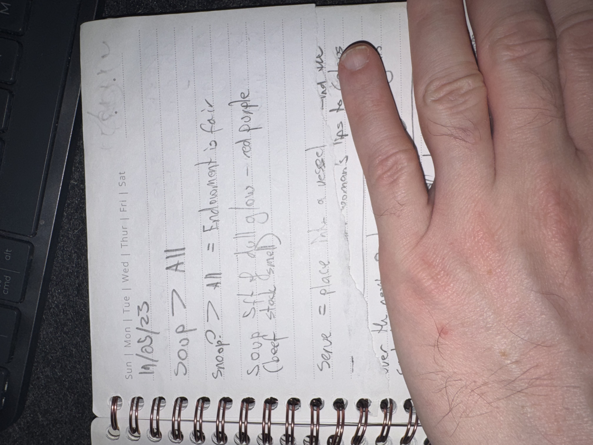

# IMG_2630 (2023-05-19)

#crab-book #paper-notes

## Transcription (best-effort)

- “19/05/23”
- “SOUP > ALL”
- “Snoop > All = Endowment is fair”
- “Soup, set of all else — red purple (set?)” (**[To verify]**)
- “serve = place the … used …” (**[To verify]**)
- **[To verify]** “humans …”

## Structured Extraction

- **[Voltaire-only]** A silly/gnomic hierarchy mantra (“SOUP > ALL”) with set-theory flavor; likely in-character rambling.

