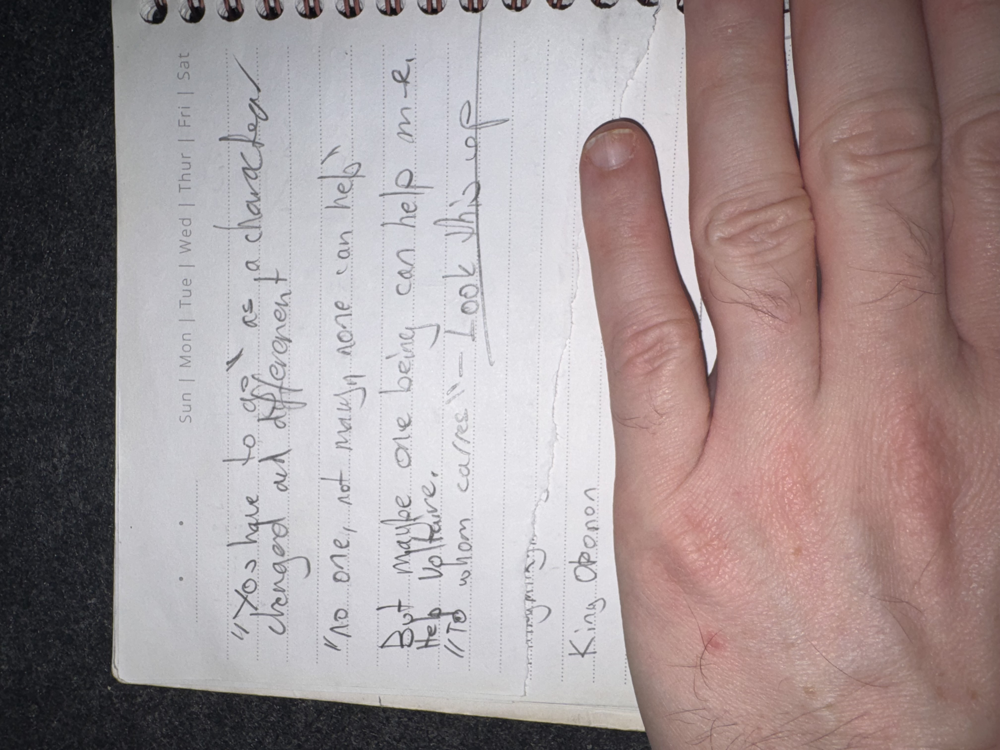

# IMG_2631 (undated)

#crab-book #paper-notes

## Transcription (best-effort)

- “It’s true to give as a chamber changed all different.”
- “No one, not many, no one can help”
- “But maybe one being can help me to thrive.”
- “The words from Cadres — took them up” (**[To verify]**)
- “King Oponon”

## Structured Extraction

- **[Voltaire-only]** A despair-to-purpose fragment: only one being might help Voltaire “thrive.”
- **[Voltaire-only]** Reinforces “King Oponon” as a recurring named figure.

