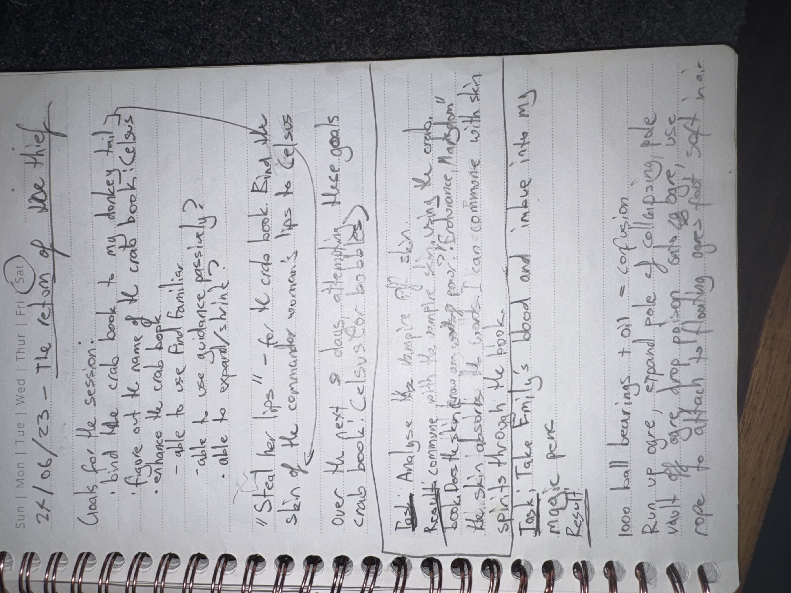

# IMG_2632 (2023-06-21)

#crab-book #paper-notes #inventory

## Transcription (best-effort)

- “21/06/23 — the return of the thief”
- Goals for the session:
  - bind the crab book to my donkey tail
  - figure out the name of the crab book: [[Celsus]]
  - chance the crab book
  - able to use [[Find Familiar]]
  - able to use guidance, prestidigitation?
  - able to expand spell?
- “Start new lvl 7 — for the crab book. End the commander woman’s lips to Celsus skin of the bad guy”
- “over the next 2 days attempting … crab book! Celsus for babble(s)” (**[To verify]**)
- Test: “Analyze the banging of skin”
  - Results: commune with the vampire skin (example: “emotions”)
  - look into “glow … book” / “enchanting” (**[To verify]**)
  - “book looks to consume skin … absorbed the blood. I can commune with skin spirits through the book”
- Test: “Take Emily’s blood and imbue into my magic [pen?]” (**[To verify]**)
  - Result: … (**[To verify]**)
- Inventory fragments:
  - “1000 ball bearings + oil = confusion”
  - “Run up ogre, … peel of collapsing pole”
  - “vial of … drop poison … use rope to attach, throwing ogre’s …” (**[To verify]**)

## Structured Extraction

- **[Party]** Binding step: crab book bound to Voltaire’s donkey tail (major artifact-state transition).
- **[Voltaire-only]** Name recorded/affirmed: [[Celsus]].
- **[Voltaire-only]** Early capability ideas: guidance/prestidigitation/find familiar; spell expansion (unclear if mechanical planning or ritual concept).
- **[Voltaire-only]** Confirmed-ish behavior: the book consumes/absorbs blood and supports communing with skin spirits (**[To verify]**).
- **[Voltaire-only]** Combat ideas / kit combos: ball bearings + oil; pole of collapsing; poison vial + rope throw (tactics brainstorming).

## Follow-ups (Codex)

- Consider cross-linking with `Codex/Items/Crab Book/Crab Book.md` and `Codex/Characters/Celsus.md` for “commune with skin spirits” + “moves on Voltaire’s initiative” notes (pending verification).

