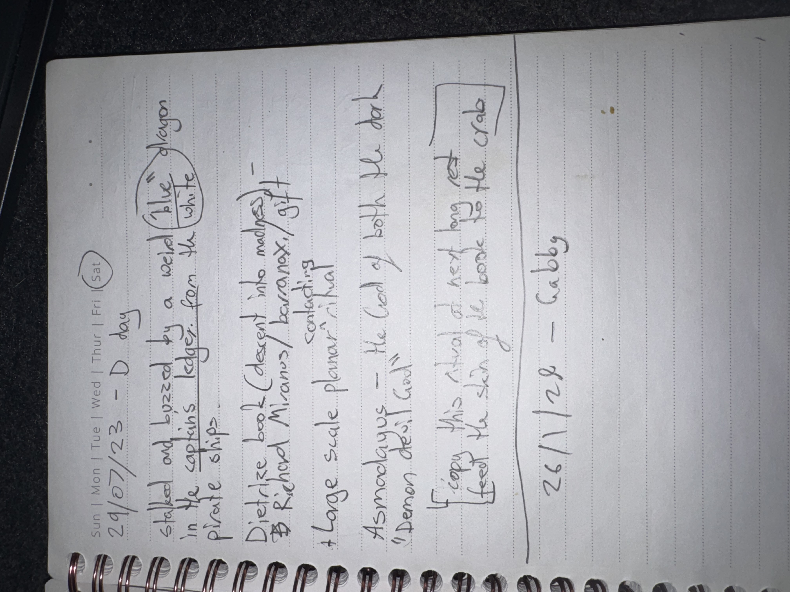

# IMG_2634 (2023-07-29)

#crab-book #paper-notes #inventory

## Transcription (best-effort)

- “29/07/23 — D day”
- “stab and buzzed by a weird (blue/black/white) dragon”
- “in the captain’s ledger … pirate ship”
- “Detective book descent into madness”
- “Richard Miranus / Barranay / [Avang]” (**[To verify]** spelling)
- “+ large scale planar ritual … contracting”
- “Asmodayus — the lord of both the dark ‘Demon devil’ (card)”
- “I copy this ritual of next … (skin?) … the book … the crab” (**[To verify]**)
- “26/1/26 — Gabby”

## Structured Extraction

- **[Party]** A “weird” dragon encounter involving a stabbing/buzzing event (**[To verify]** exact scene).
- **[Voltaire-only]** “Detective book descent into madness” (meta note or artifact thread).
- **[Voltaire-only]** Links hostile list / names: [[Richard Miranus]], [[Barranay]], [[Avang]].
- **[Voltaire-only]** Mentions “large scale planar ritual” + “contracting” (ties to true-name/contract themes).
- **[Voltaire-only]** “Asmodayus” referenced as “lord of … demon/devil (card)” (likely Asmodeus concept).
- **[To verify]** “Gabby” (2026-01-26) looks like an OOC note or NPC name; needs confirmation.

