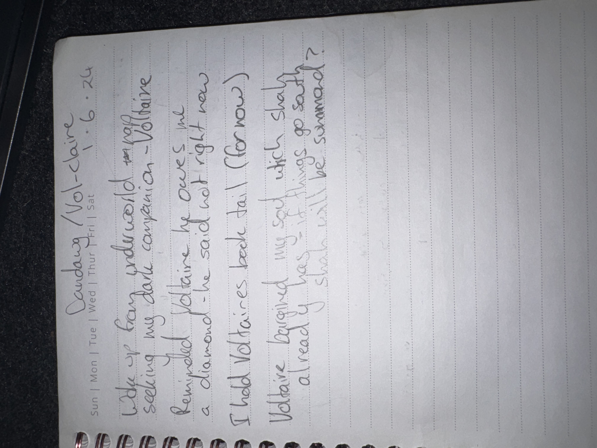

# IMG_2636 (2024-06-06)

#crab-book #paper-notes

## Transcription (best-effort)

- “Duacday / Volt-claire 6.6.24”
- **[To verify]** “Wake up, fancy underwear … seeking way … companion … to Claire”
- **[To verify]** “Reminded Voltaire he … a diamond … he said not right now”
- **[To verify]** “I had Voltaire’s bed tail (for now)”
- **[To verify]** “Voltaire brought my sad witch. Shay’s go sad? She will be summoned?”

## Structured Extraction

- **[To verify]** This reads partially OOC / out-of-character meta-notes (names “Claire” and “Shay” appear; unclear if PCs/NPCs/players).
- **[To verify]** Mentions a “diamond” discussed/declined.
- **[To verify]** Mentions “bed tail” (possibly a joke about the crab-book-tail).

