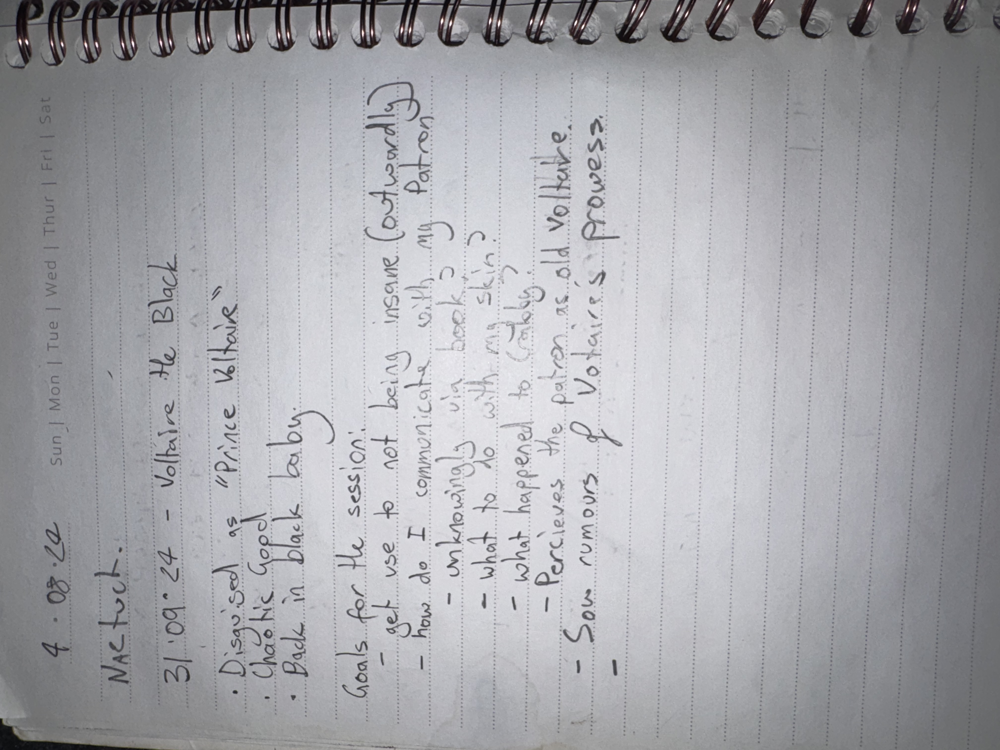

# IMG_2637 (late-2024)

#crab-book #paper-notes

## Transcription (best-effort)

- “31/09/24 — Voltaire the Black”
  - “Disguised” “Prince Voltaire”
  - “Chaotic good”
  - “Back in black baby”
- Goals for the session:
  - get used to not being insane (outworldly)
  - how do I communicate with my patron?
  - unknown what is in book?
  - what to do with my skin? (tattooing)
  - what happened to Greg?
  - perceived the power as old Voltaire
  - “saw rumors of Voltaire’s prowess”

## Structured Extraction

- **[Voltaire-only]** Persona affirmation: “Voltaire the Black” / “back in black baby”.
- **[Voltaire-only]** Alignment note: “Chaotic good” (**[To verify]** if real shift or mood).
- **[Voltaire-only]** Core uncertainties logged: patron communication, book contents, skin/tattoo plan, Greg’s status; sensed “old Voltaire” power.

## Notes

- **[To verify]** Date is written “31/09/24” (September 31 does not exist); treating as “late 2024” pending confirmation.

