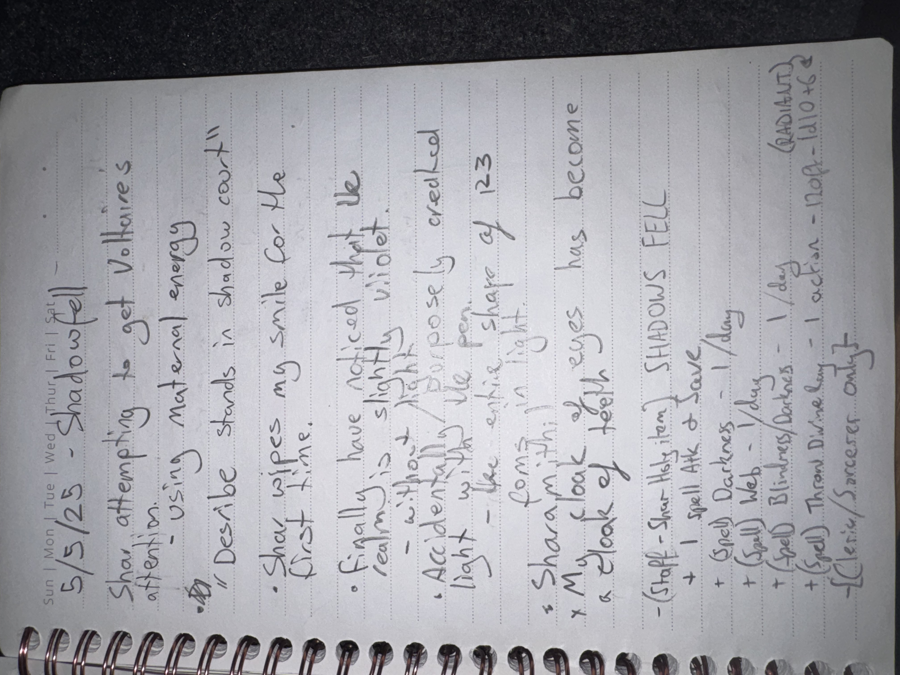

# IMG_2638 (2025-05-05)

#crab-book #paper-notes

## Transcription (best-effort)

- “5/5/25 — Shadowfell”
- Shar attempting to get Voltaire’s attention; using maternal energy
- “Describe stands in shadow court”
- Shar wipes my smile for the first time
- Finally I have noticed that he dreams is slightly violet; “it almost likes me”
- Accidentally (?) cranked the pen light with the entire share of 123 coins in it.
- **[To verify]** “Sharamini” / similar
- “My cloak of eyes has become a black of teeth eyes”
- “(staff) Shar … Totem”
  - **[To verify]** “I smell like a Javel…”
  - **[To verify]** “+1”
  - **[To verify]** “+ Glasya … / day”
  - **[To verify]** “+ Full Web — 1/day”
  - **[To verify]** other dawn/uses lines
  - **[To verify]** “(cleric/sorcerer only?)”

## Structured Extraction

- **[Voltaire-only]** Major affect change: Shar wiped Voltaire’s fixed smile “for the first time” (**[To verify]** literal, temporary, or symbolic).
- **[Voltaire-only]** Perception note: “dream” described as slightly violet and “almost likes me” (**[To verify]** what “he” is).
- **[To verify]** “pen light” interacting with “123 coins” (soul coins? crab-book sketches? another coin trove?).
- **[Voltaire-only]** Gear/body-horror note: “cloak of eyes” becoming “black of teeth eyes” (possible [[Robe of Eyes]] corruption) (**[To verify]**).
- **[To verify]** Staff/totem list appears to be mechanical boons with daily limits; needs reconciliation with existing item/power entries.

