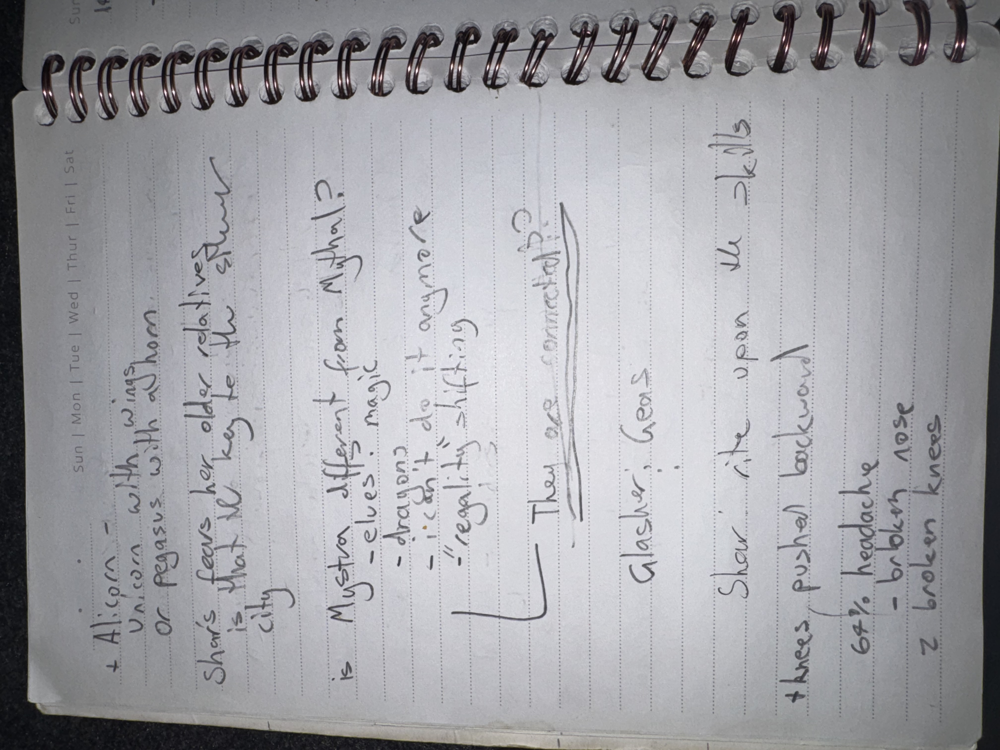

# IMG_2639 (undated)

#crab-book #paper-notes

## Transcription (best-effort)

- “+ Alicorn — Unicorn with wings”
- “or Pegasus with alicorn”
- “Shar’s fears her older relative is that the key to the Silver city”
- “is Mystra different from Mystral? magic?”
  - “dragon?”
  - “if I do it anywhere”
  - “reality shifting”
- “Then are contracts?”
- “Glasya fears …”
- “Shar: ‘in the open the details’”
- “threes pushed backward”
- “Got a headache”
  - “broken nose”
  - “broken knees”

## Structured Extraction

- **[Voltaire-only]** Mythology questions: alicorn definition; Mystra vs Mystral distinction.
- **[Voltaire-only]** “Silver City” reappears; tied to Shar’s “older relative” and a “key” (unclear; likely speculative).
- **[Voltaire-only]** Contracts again flagged as a central mechanism.
- **[To verify]** Injury notes: headache/broken nose/broken knees (unknown session context).

