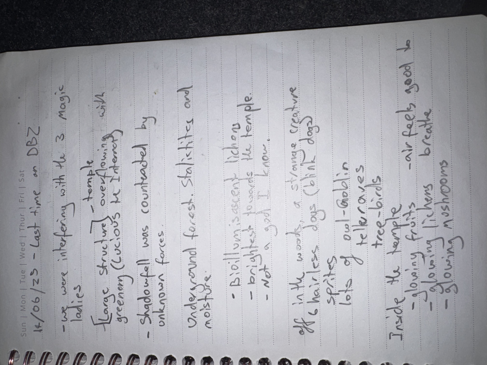

# IMG_2640 (2023-06-14)

#crab-book #paper-notes #tactics #loot

## Transcription (best-effort)

- “14/06/23 — last time on DBZ”
- “we were interfering with the 3 magic ladies”
- “Large structure (overflowing with greenery) (vicious the Internet)” (**[To verify]**)
- “Shadowfell was contacted by unknown forces”
- “underground forest, stalictites and moisture”
- “Bioluminescent lichen”
  - “brightest to wards the temple”
  - “not a good … I know”
- “in the woods, a strange creature of hairless dogs (blink dog)”
- “lots of owl-gabby treasures”
- “inside the temple”
  - “glowing fruits”
  - “glowing lichens — are fed, good to breathe”
  - “glowing mushrooms”

## Structured Extraction

- **[Party]** Environment notes: underground forest; stalactites; moisture; bioluminescent lichen; glowing flora (fruits/lichen/mushrooms) in/near a temple.
- **[Party]** Shadowfell contact/pressure by unknown forces (possible portal influence).
- **[To verify]** “3 magic ladies” as a scene anchor (needs identification).
- **[To verify]** “owl-gabby treasures” (phrase unclear; could be “owl, gabby, treasures” or a name).
- **[Party]** Mention of hairless dogs / blink dog.

