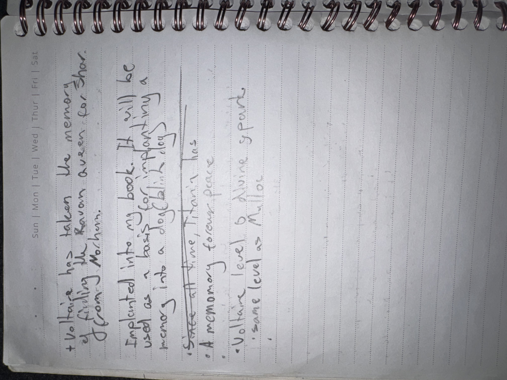

# IMG_2641 (undated)

#crab-book #paper-notes

## Transcription

- “Voltaire has taken the memory of killing the Raven Queen for Shar (from Mothman).”
- “Implanted into my book. It will be used as a host for implanting memory into a doofblinky lady.”
- “Stake at Throne Titrania has”
- “A memory forena place”
- “Voltaire level 6 / Divine spark — same level as Mystral.”

## Structured Extraction

- **[Voltaire-only]** Memory-ink plan: Voltaire claims to have taken a memory of killing the Raven Queen “for Shar” (source: “Mothman”) and implanted it into the crab-book to later implant into someone (“doofblinky lady”) (**[To verify]**).
- **[To verify]** “Throne Titrania” mention suggests Lady Titrania ties to a throne (swamp court?).
- **[Voltaire-only]** “Divine spark” note at level 6; compared to Mystral (likely metaphorical, needs verification).

