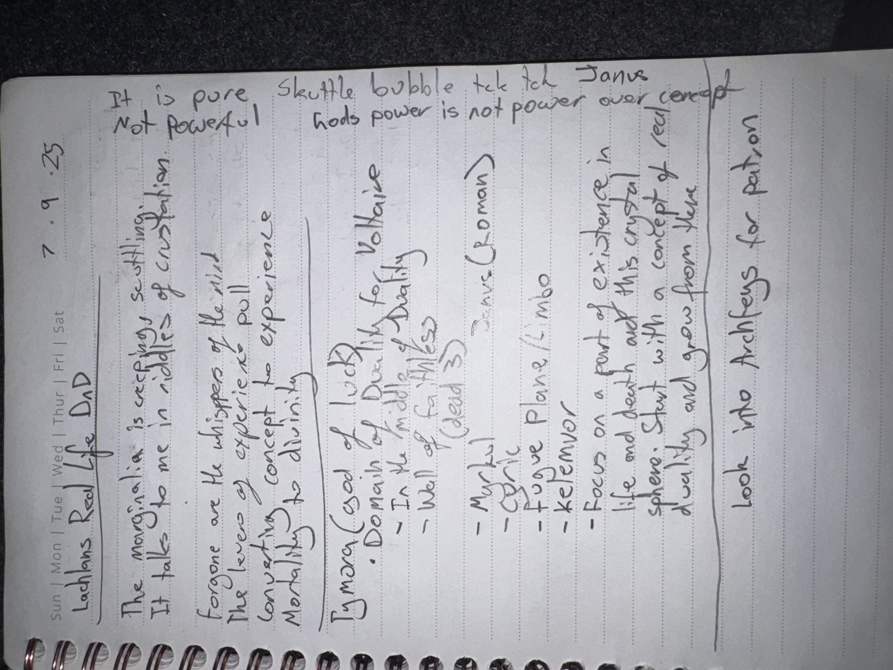

# IMG_2642 (2025-09-07)

#crab-book #paper-notes #cosmology

## Transcription (best-effort)

- “7.9.25”
- **[To verify]** “Lathans/Lathander’s Red Life D&D”
- “The Margin is crispy crustling”
  - “It take(s) me in circles — of crustation”
- “For none are the whispers of the wild”
  - “The lovers of experience”
  - “contrasting concept to experience”
  - “Mortality to divinity”
- “Tymora (god of luck)”
- “Domain of Duality for Voltaire”
  - “In the middle of Duality (Celsus)”
  - “Well of faithless (dead 33)” (**[To verify]**)
  - “Murky”
  - “Cyclic”
  - “Fugue Plane / …” (**[To verify]**)
  - “Kelemvor”
- “Focus on a point of existence in life and death and this crystal sphere. Start with a concept of red duality and grow from that.”
- “look into Archfiends for patron”
- **[To verify]** “god’s power is not power over concept”

## Structured Extraction

- **[Voltaire-only]** Voltaire’s cosmology sketch: a “Domain of Duality” anchored by [[Celsus]], with references to the Fugue Plane and [[Kelemvor]] (life/death administration).
- **[Voltaire-only]** Patron-shopping note: consider archfiends as patron candidates (even while Voltaire self-patrons in other notes).
- **[Voltaire-only]** Theme statement: “god’s power is not power over concept” (metaphysics thesis).

## Notes

- Date format appears to be `DD.MM.YY`; treating as **2025-09-07** pending confirmation.

