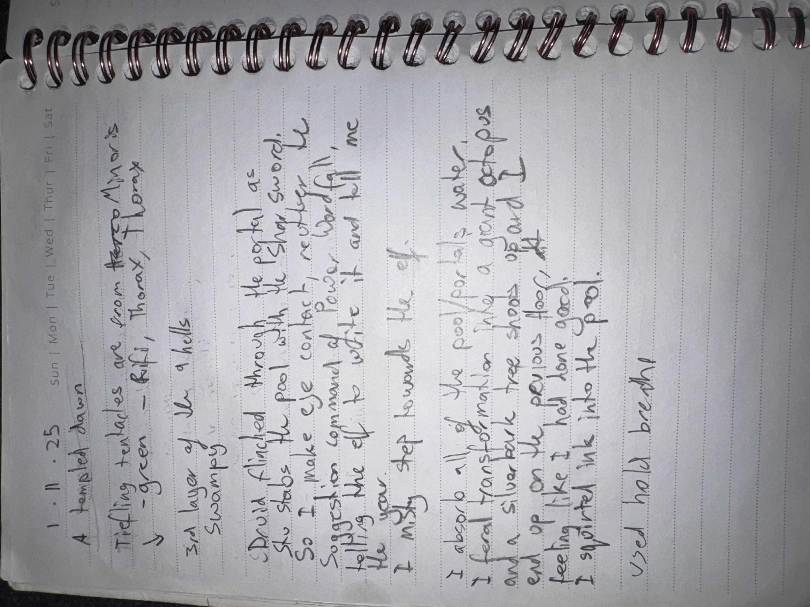

# IMG_2643 (2025-11-01)

#crab-book #paper-notes #ritual

## Transcription (best-effort)

- “1.11.25”
- “A temple’d dawn”
- **[To verify]** “Tiefling tentacles are from …” (mentions: green / Rifli / Thorax / Tlborax? unclear)
- “3rd layer of the 9 hells — swamps”
- “Druid flinched through the portal as she stabs the pool with the silver sword”
- “So I make the contract / request / suggestion / command of peace …” (**[To verify]**)
- “I step towards the …”
- “I absorb all of the pool … water.”
- “I feel transformation … like a giant octopus … and a silver formation …” (**[To verify]**)
- “I ignited ink into the pool”
- “used hold breath!”

## Structured Extraction

- **[Party]** A vivid ritual scene: a druid stabbed a pool with a silver sword at/through a portal; Voltaire interacted with the pool water and ink.
- **[Voltaire-only]** Voltaire framed actions as contract-driven (“contract/request/command of peace”).
- **[To verify]** “3rd layer of the 9 hells — swamps” suggests Minauros-like imagery, but the note’s in-world target needs confirmation.

## Notes

- Date format appears to be `DD.MM.YY`; treating as **2025-11-01** pending confirmation.

