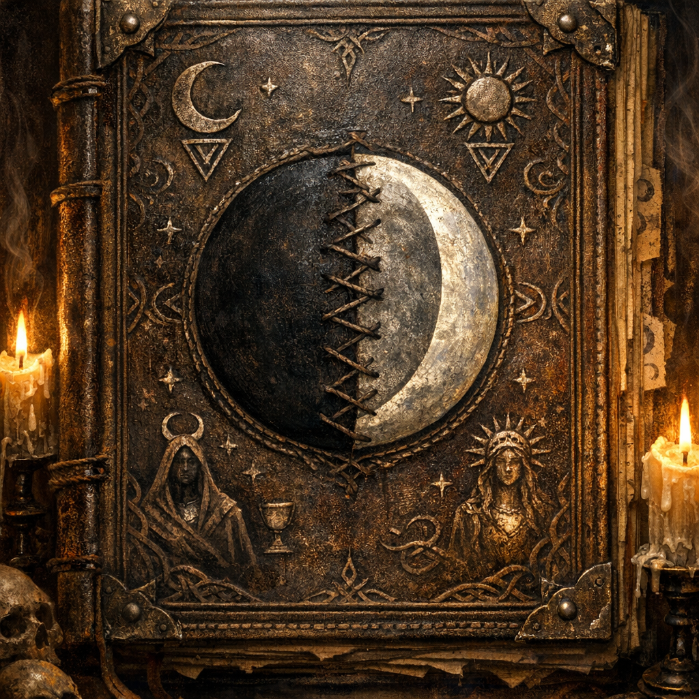

# Dark Moon Heresy

#item #book #shar #selune #heresy #to-verify

## Summary

A leatherbound “heresy” text discovered in the Warlock Knights’ restricted library. It provokes immediate revulsion in Cornholio and presents an overtly blasphemous thesis about the moon goddesses.

## What Happened (2026-02-21)

- **[Party | To verify]** Cornholio found a book that “called” to him and made him feel awful; he threw it at Voltaire.
- **[Voltaire-only | To verify]** Voltaire caught the book with the crab-book-tail and **absorbed** it.

## Claims / Ideas Surfaced — To Verify

- **[Party | To verify]** **Shar and Selûne are the same being.**
- **[Voltaire-only | To verify]** Voltaire (in a moment of “clarity”) believed he had “married” a god he labels “BPD.”  
  - **[To verify]** What Voltaire meant by this; treat as Voltaire’s in-character shorthand, not a clinical statement.
- **[Party | To verify]** Selûne is a guardian/anchor for **lycanthropes** (an “aspect” Voltaire claims he never understood).

## Open Questions (To Verify)

- Is this book **warded/tracked** by the Warlock Knights?
- Is it a **trap** (curse/meme-lore) aimed at Cornholio’s Shar entanglement?
- Does it connect to the requested blood reagents (were-blood, hellhound blood, “butterfly blood”) and the Tower’s sigil maintenance?
