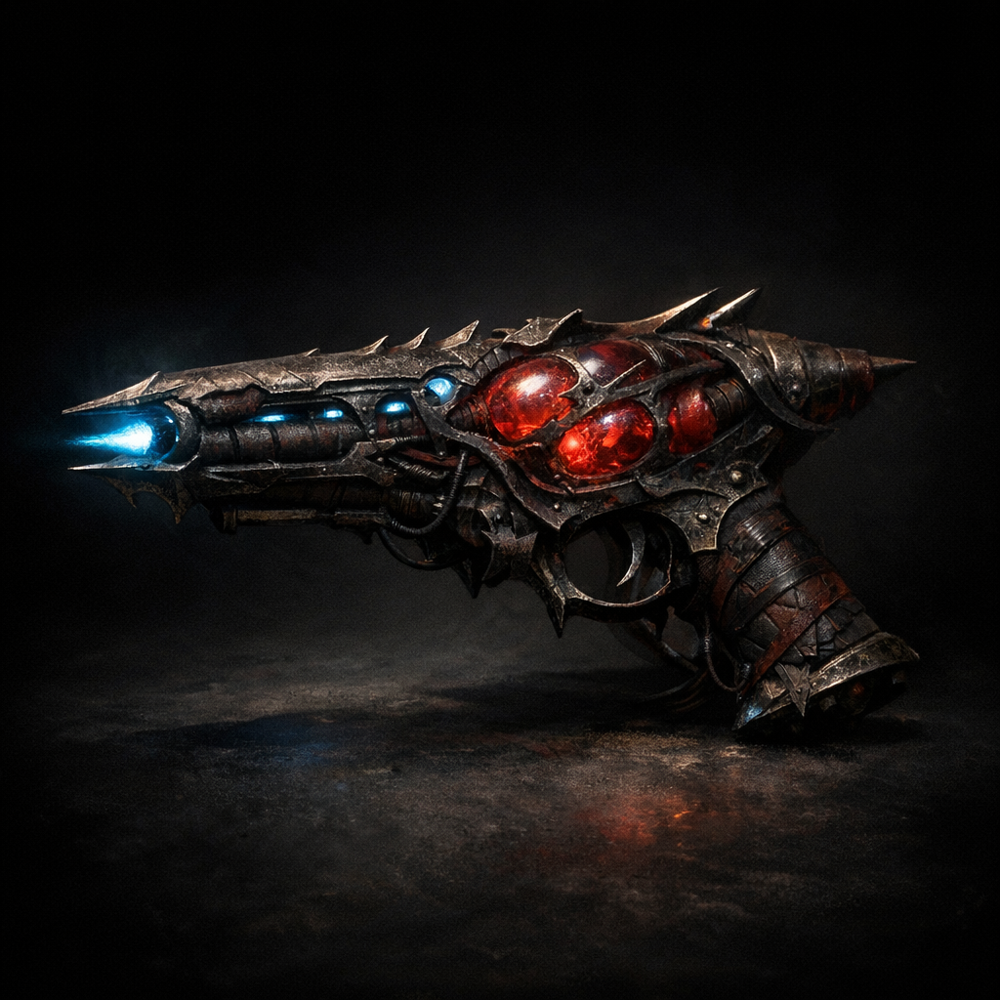

# Eldritch Caster

#item #weapon #outsider-tech

## Summary

An “Eldritch Caster” (aka “red goo blaster” in party slang) is an outsider-tech ranged weapon encountered in the desert north of [[Palischuk]] and later wielded by tainted gnomes in tunnel ambushes. It fires force-like energy bolts, and (per identification notes) appears to **consume spell slots** as fuel.

## Description (as recorded)

- **Size/Weight**: ~3 ft 6 in long; ~18 lbs; two-handed.
- **Power source**: a bauble containing **blood** (Outsider/Fiend/Celestial), where the origin affects the color.
- **Range**: noted as 120 ft (**[To verify]**; see scaling table below).
- **Damage type**: force (described as “green force bolts” in combat notes).

## Mechanics (notes; to verify)

- “Costs spell slots to use.”
- “Brooch of Shielding prevents all damage from Eldritch Caster.”

### Recorded scaling table (uncertain interpretation)

| Slot level | Dice | “Range” | Notes |
|---:|---|---:|---|
| 0 | 1d10 | 110 | “2 beams” |
| 1 | 4d4 | 416 |  |
| 2 | 6d6 | 636 |  |
| 3 | 8d6 | 848 |  |
| 4 | 16d4 | 1664 |  |

**[To verify]** What the “Range” column represents (ft? squares? max targeting distance?) and what “0” denotes (cantrip-equivalent, no-slot mode, or a special battery mode).

## Variants

- A later-recovered model used a **deep black crystal** with weak opalescent/plasmon shimmer instead of fluid/blood as the power core (**[To verify]** whether this changes damage, alignment, or side-effects).

## Open Questions

- Are Eldritch Casters manufactured, salvaged (spelljammer), or “grown”?
- Does the weapon’s blood origin (Fiend/Celestial/Outsider) change more than color?
- What entities benefit from seeding these weapons into local conflicts?
