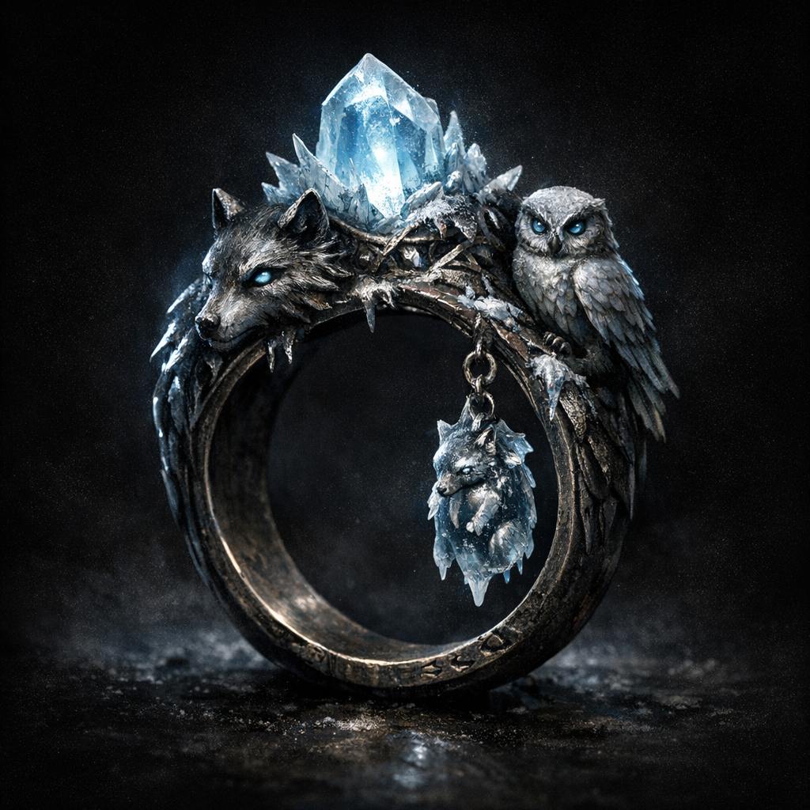

# Familiar Ring from Glacier

#item #ring #familiar #to-verify

## Summary

A named ring in Voltaire’s D&D Beyond inventory. The name implies a link to a place/person/event called “Glacier” and to familiar-binding.

## What the Party Knows (in-play)

- Voltaire possesses a “Familiar Ring from Glacier” (per sheet inventory).

## Open Questions

- What is “Glacier” in this campaign: a location, an NPC, a codename, an event?
- Does the ring summon/bind a familiar, store one, or enhance `find familiar`?
