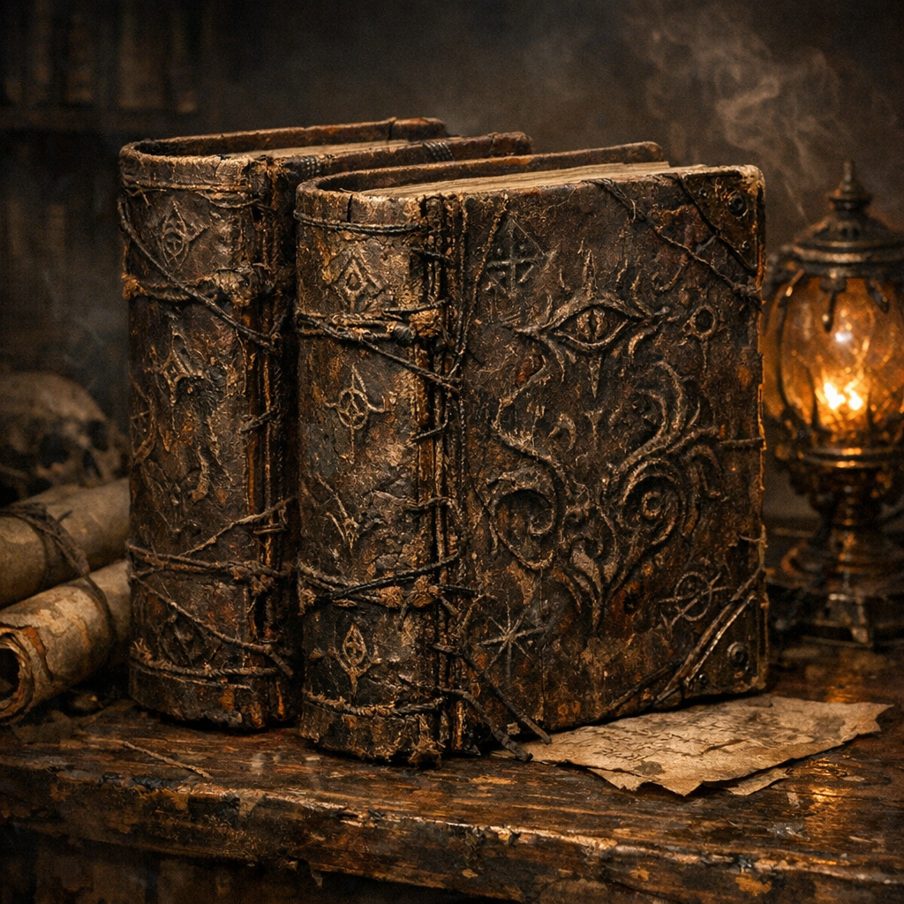

# Glimpse within the Abyss (Two Volumes)

#item #book #abyss #to-verify

## Summary

A two-volume leatherbound work on the **Abyss** attributed to **[[Tayhra Savras]]**, “the mad seer of Manshaka.” The books are described as covering Abyssal goings-on and practical methods to **contact/raise/communicate** with demons (and related infernal material).

## What Voltaire Did (2026-02-21)

- **[Voltaire-only | To verify]** Voltaire found **two volumes** of this work in the Warlock Knights’ restricted library and **pocketed** them.

## Contents (as described) — To Verify

- **[Voltaire-only | To verify]** Overview of the Abyss and its politics/forces.
- **[Voltaire-only | To verify]** Methods to **contact demons and devils** (ritual steps, names, offerings, safety constraints).

## Open Questions (To Verify)

- Are these volumes warded/tracked by the Warlock Knights?
- Are there true names, sigils, or planar “addresses” inside?
- Is Tayhra Savras a historical seer, a living threat, or a pseudonym used by the Knights?

