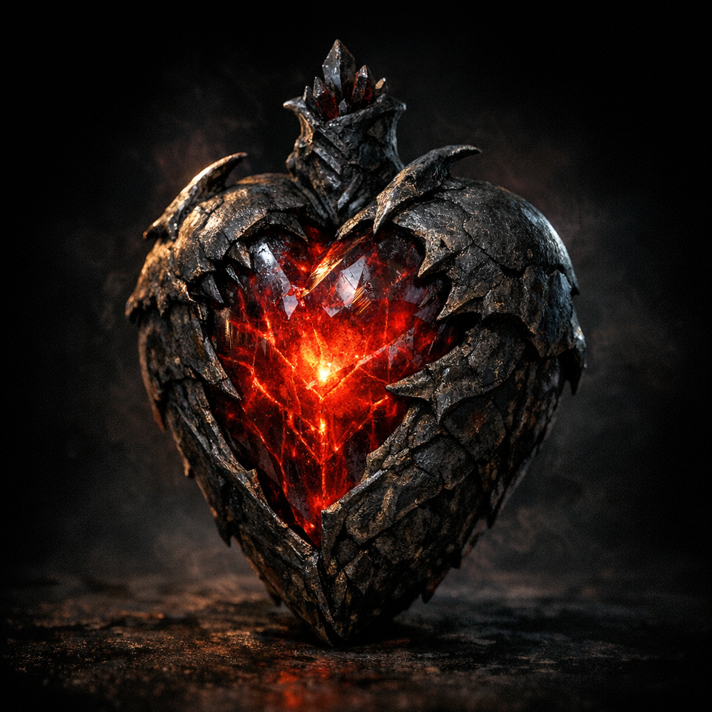

# Heart of Lorkan

#item #relic #mystery

## Summary

“The heart of Lorkan” was retrieved by Dagoth as major loot after the Tiamat-shrine incident that produced Night Gaunts and tomb dwarves.

## What the Party Knows (in-play)

- Dagoth retrieved the heart of Lorkan (no further description in the referenced notes fragment).

## Open Questions

- Is this a literal heart, a power core, or a metaphorical relic name?
- What does it do, and what is its provenance (spelljammer salvage, divine remnant, outsider-tech)?
