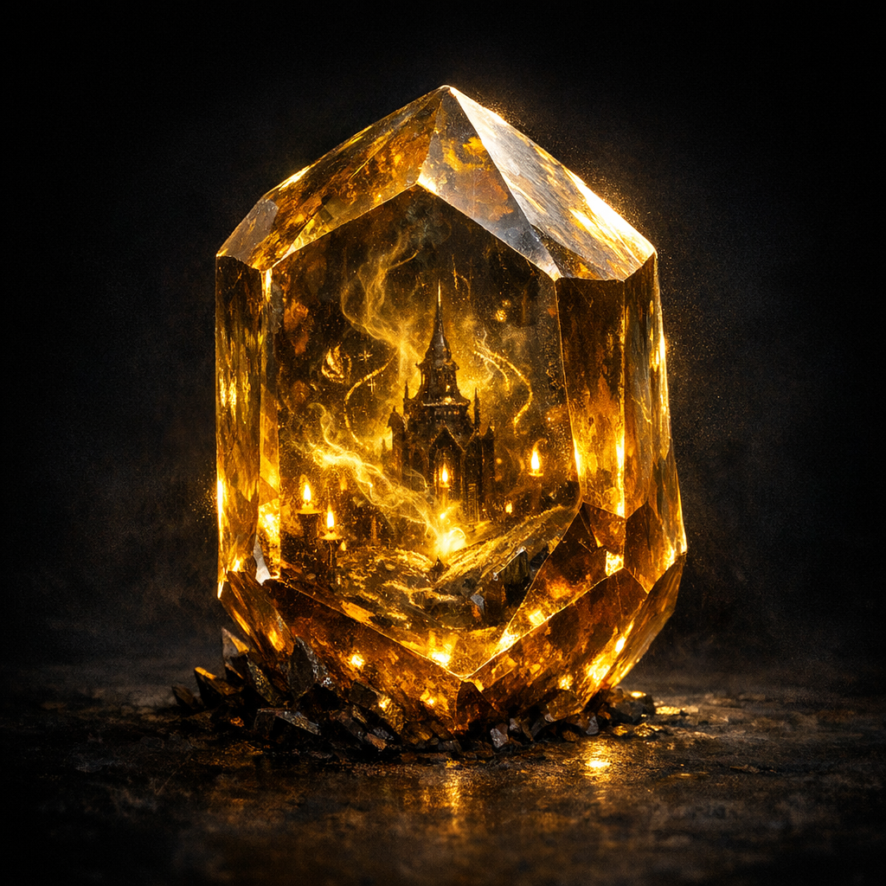

# Heliodore Gems

#item #gem #warlock #altars

## Summary

Heliodore gems (yellow-stained, in the referenced loot) were identified at the table as being under “outside influence” and described as **altars and spellbooks for warlocks**—suggesting a gem-as-grimoire paradigm in this campaign.

## What the Party Knows (in-play)

- Loot included **4 heliodore gems**, “yellow stained.”
- Cromash announced they were under outside influence.
- The DM stated the Heliodores are “altars and spell books for Warlocks.”

## Open Questions

- Are Heliodores a benign warlock tool (like a focus), or a Trojan altar?
- What entity is the “outside influence” (Shar, Glasya, Hydra/Dagon, something else)?
- Does using them grant power at a hidden cost (pact clause, attention, corruption)?
