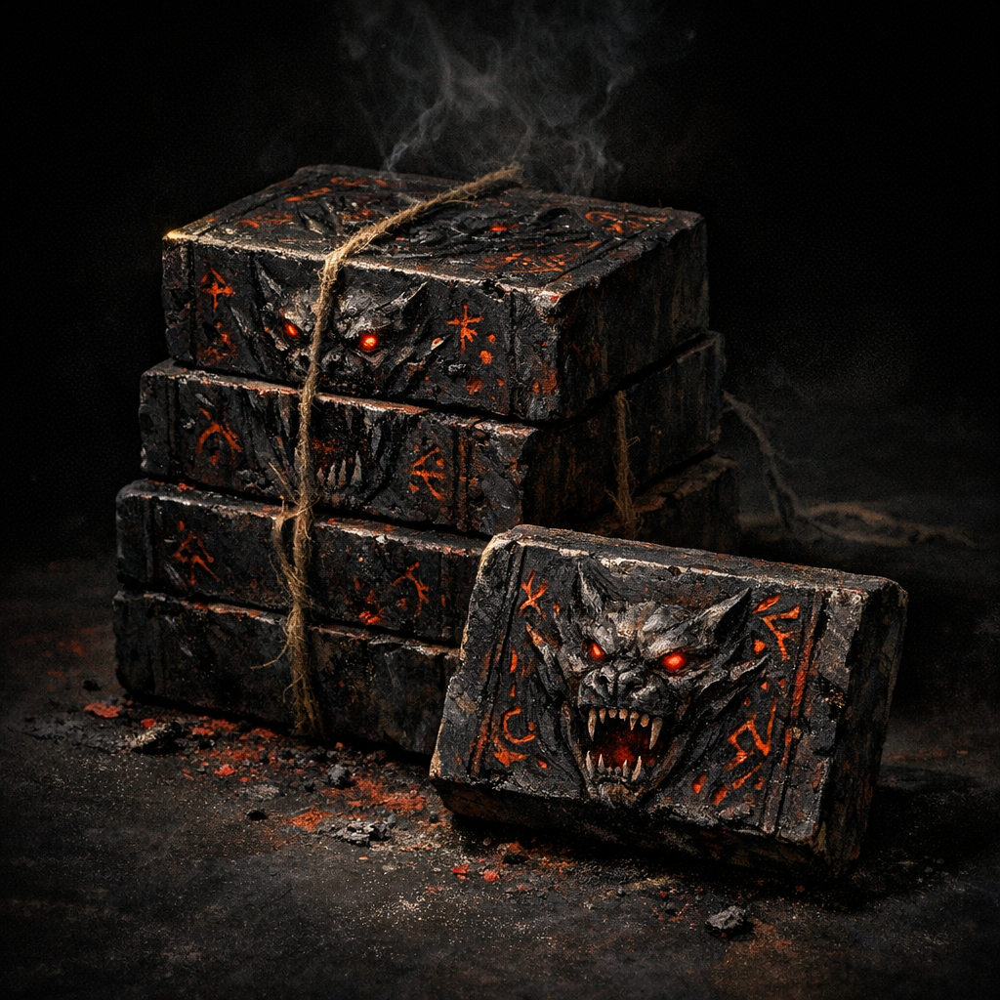

# Hellhound Ink Bricks

#item #crafting #ink

## Summary

A stock of “hellhound ink bricks” recorded in Voltaire’s paper-sheet notes, likely used for the [[Crab Book]] and/or [[The Ink of Unbeing]] work.

## Known Quantity (paper sheet)

- “10 units”

## Voltaire-Only Notes

- Written adjacent to body/ritual notes (“slice through the skin on my left chest”).
- **[To verify]** Composition and whether this is literal hellhound blood, a hardened ink medium, or both.

## In-Play Use (as later recorded)

- During the confrontation where [[Glasya]] was closing a hole in reality, Voltaire used a quill/pen with hellhound ink to draw a new enclosing circle and sealed it with the word of power **[[Word of Power - Fall]]** (noted as occurring “all in 6 seconds”).
