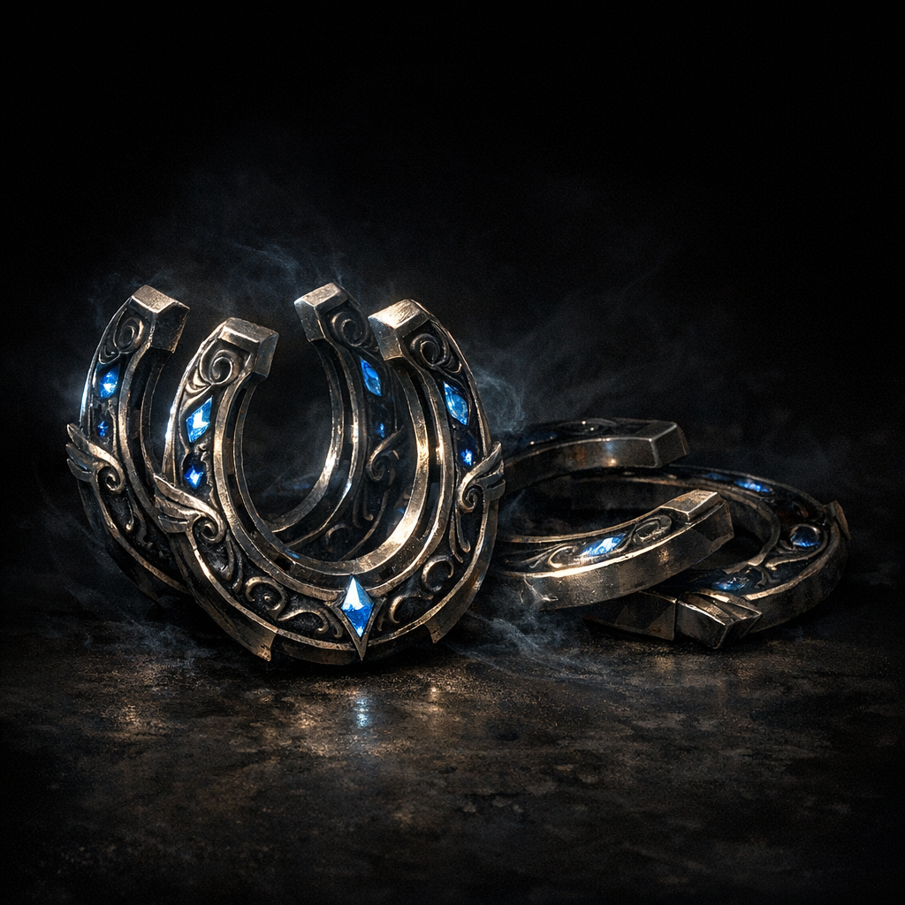

# Horseshoes of the Zephyr

#item #vehicle #mobility

## Summary

Horseshoes of the Zephyr were sought obsessively in the [[Abeil Hive City]] arc and later used to upgrade the party’s carriage for levitation/overland mobility.

## What the Party Knows (in-play)

- Cornholio received **3** horseshoes as part of Hive City rewards (as recorded in notes).
- The party used the horseshoes to refit the carriage so it could “levitate,” with contingency design choices for anti-magic zones.

## Notes (rules fragment; to verify)

- The “zephyr sleds” were ruled to “feel friction as per the surface beneath them.”
- Pull speed was discussed in terms of phantom steeds and friction penalties (**[To verify]** the finalized movement rule used at the table).

## Open Questions

- Were all 4 horseshoes ever obtained, or is the carriage running on an incomplete set?
- Are the horseshoes now permanently installed, or removable/portable?
