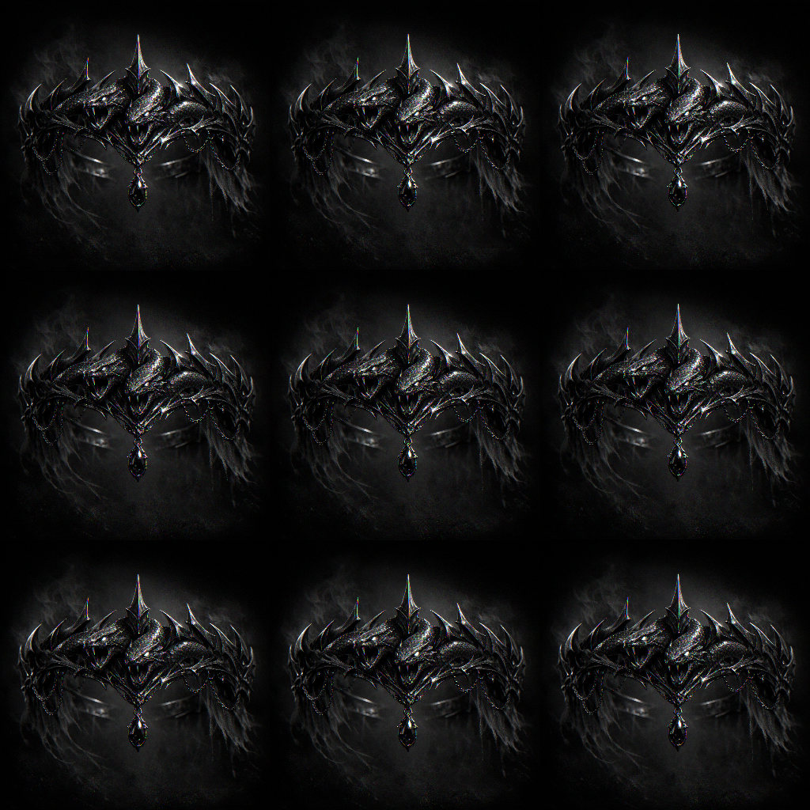

# Hydra's Veil

#item #crown #mother-hydra #outsider-gold

## Summary

“Hydra’s Veil” is the identified name (in notes) for the outsider-gold tiara/crown found in an elven bone puzzle box and later transmuted by [[Shar]] into **[[Shadow's Weave]]**.

## Known Properties (notes; to verify)

- **Attunement**: required
- **Value**: ~20,000 gp
- **Permanent mending enchantment**
- **Summon a Moon Rat** on full moons
- **Moonbeam**: cast once per day at 3rd level (upcast)
- **Water Breathing** and **30 ft swim speed**
- “Crown allows worship and Warlock patron to Mother Hydra” (**[To verify]** how explicit/forced this binding is)

## Transformation

- In a restored shrine to [[Shar]], the tiara:
  - shifted from [[Outsider Gold]] into [[Lunar Silver]]
  - converted its central ruby into moonstone
  - became [[Shadow's Weave]]

## Open Questions

- Did the tiara “want” to be repaired with jewels, or was that Cornholio’s improvisation?
- What happened to the “veil” aspect once Shar re-keyed it—did it become concealment, surveillance, or devotion?
