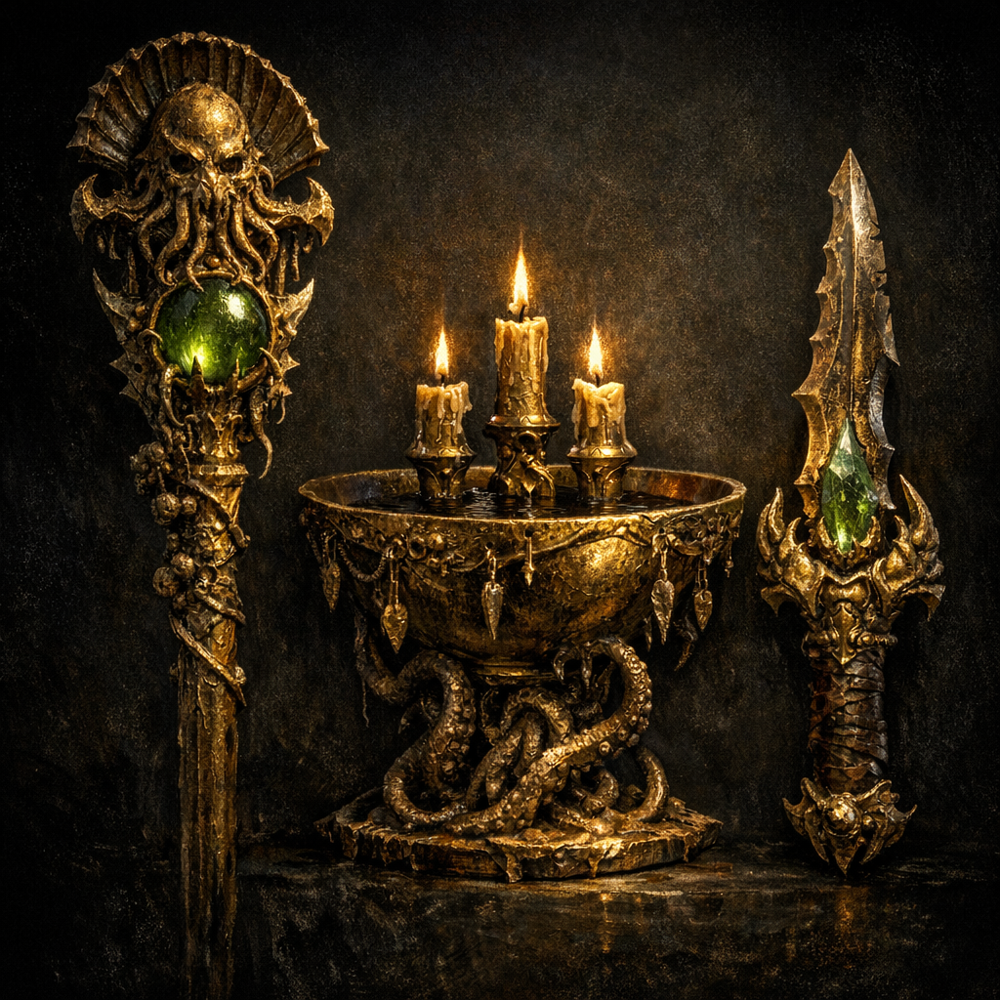

# Implements of Mother Hydra

#item #artifact-set #mother-hydra #outsider

## Summary

The “Implements of Mother Hydra” refers to a set of outsider-gold artifacts recovered from heretic Abeils in the older tunnels beneath [[Palischuk]] / the [[Abeil Hive City]] mining complex. They are tied to an “ancient outsider evil deity” described as [[Mother Hydra]], and appear designed to **bind worship**, **seed patronage**, and **weaponize divination**.

## Components (as identified in notes)

- [[Staff of Mother Hydra]] (multiple recovered)
- [[Hydra's Veil]] (a tiara/crown later transformed into [[Shadow's Weave]])
- [[Relic of Augury]]
- **Fae leather** (mentioned as being created by the priestess / Mother Hydra’s implements; details unclear)

## Campaign Significance

- The implements are a tangible bridge between:
  - outsider materials ([[Outsider Gold]]),
  - the heretic Abeil sect,
  - and the larger planar surveillance/cult ecology around [[Shar]] and the party.
- The party deliberately withheld some implements from the Abeil Queen, implying these items are *politically radioactive*.

## Open Questions

- Is “Mother Hydra” the same entity as [[Dagon]], adjacent, or merely associated via taint?
- What is the cost of using these items (attention of gods, corruption, binding clauses)?
- Were these items manufactured locally, or imported via deeper planar routes?
