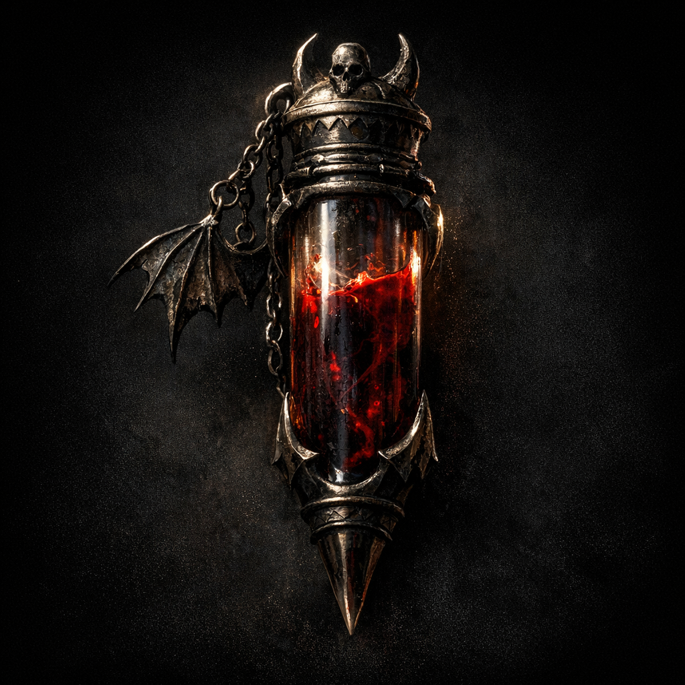

# Nightgaunt Blood Vial

#item #consumable #blood

## Summary

A vial of nightgaunt blood noted on Voltaire’s paper character sheet.

## Open Questions

- Was the blood used as ink (Crab Book / Ink of Unbeing), a spell component, or a trophy?
- Is the vial still in Voltaire’s possession?
