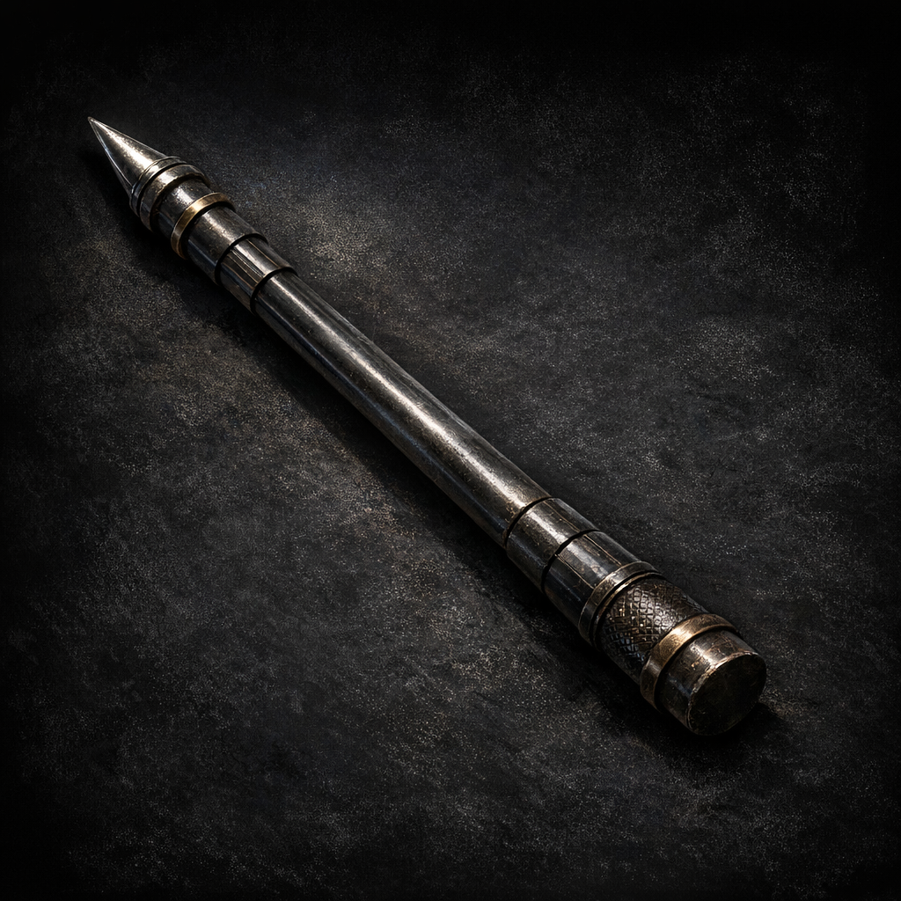

# Pole of Collapsing

#item #tool #utility

## Summary

A collapsible pole listed on Voltaire’s D&D Beyond inventory. Often used for dungeon safety, trap testing, and improvised leverage.

## What the Party Knows (in-play)

- Voltaire carries a collapsible pole (per sheet inventory).

## Open Questions

- What is its extended length and collapse method (button, command word, twist-lock)?
- Is it mundane, or subtly enchanted beyond “collapsing”?
