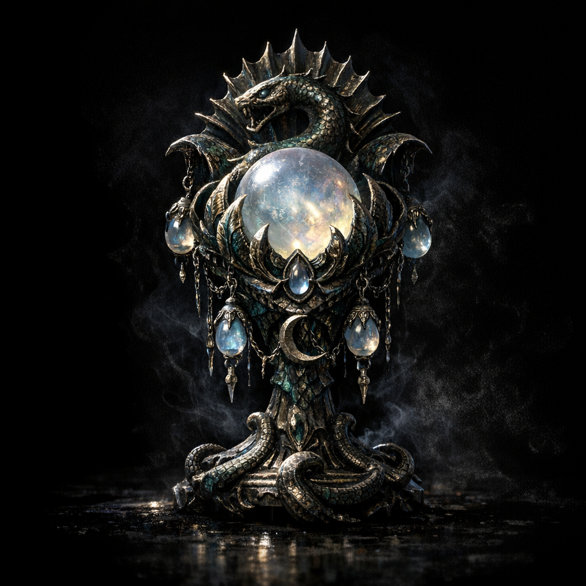

# Relic of Augury

#item #divination #moonstone #dangerous

## Summary

A divinatory implement tied to the Mother Hydra artifact set, notable for requiring moonstones and for attracting the attention of higher powers when used.

## Known Properties (notes; to verify)

- “Consumes minimum 1 gp worth moonstones” to cast `Augury` (as per spell).
- “Using it draws the attention of passing gods and demigods.”

## Why it matters

If accurate, this relic is a **divination tool with a built-in beacon**—useful for answers, dangerous for stealth.

## Open Questions

- Is the “attention” flavor-only, or does it have mechanical consequences (encounters, scrying, marks)?
- Is the attention specifically Hydra/Dagon-aligned, or any nearby higher being?
