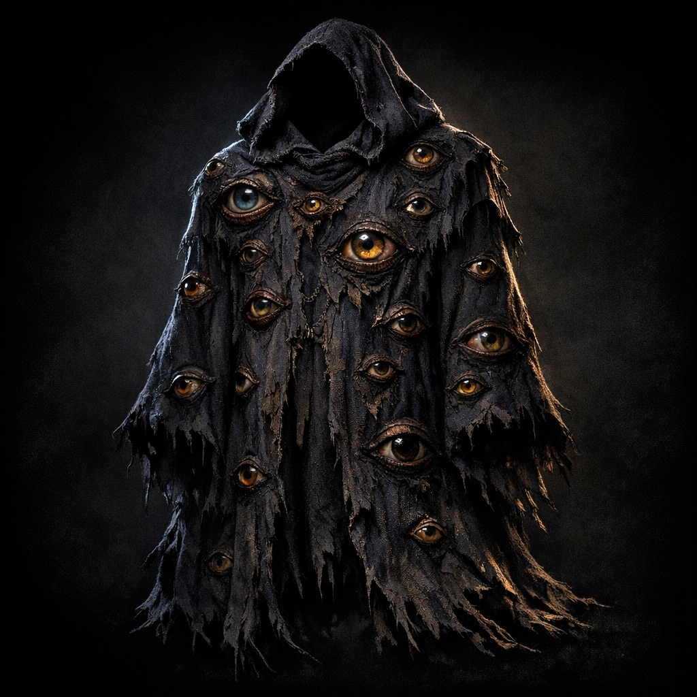

# Robe of Eyes

#item #wondrous-item #attunement

## Summary

Voltaire’s attuned robe that enhances perception and provides many-eyed awareness (see `Codex/Items/Voltaire Inventory (D&D Beyond 2026-01-25).md`).

## Party Knowledge

- Voltaire wears an unsettling robe associated with heightened sight.

## Voltaire-Only Notes

- Passive Perception has been recorded as unusually high on older sheets (consistent with expertise + heightened awareness).
- **2026-07-25 [Voltaire-only]**: Voltaire removed the robe to expose the V carved into his chest during the Shadar-kai statue-room rite.
- After destroying Mask’s hollow statue, Voltaire placed its remaining rubble onto the robe.
- **[To verify]** Whether the rubble fused with the robe, remains physically carried on it, or altered its abilities.

## Open Questions

- Does this robe match the DMG item as written, or is it homebrewed?
- **[Voltaire-only] (paper note, 2025-05-05)** “My cloak of eyes has become a black of teeth eyes” in the Shadowfell (**[To verify]** literal transformation vs. mood/poetry).
