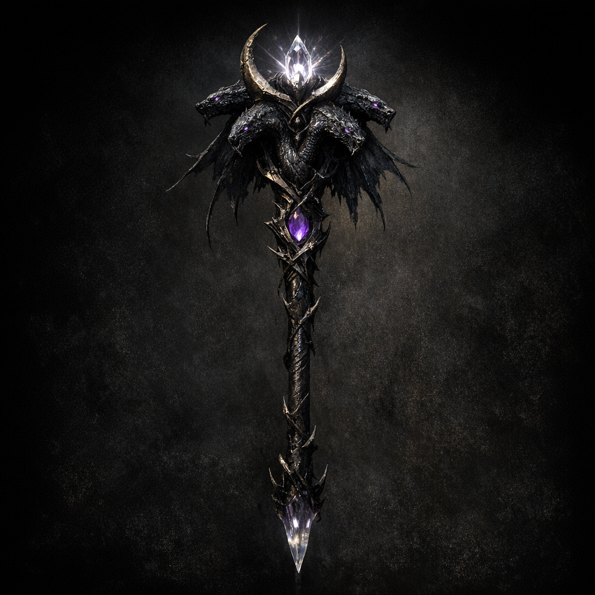

# Shadow's Fell

#item #staff #shar #transformed-artifact

## Summary

Shadow’s Fell is a staff-like artifact created when [[Cornholio]] offered a [[Staff of Mother Hydra]] to [[Shar]] in a restored shrine. It appears to be a “re-keyed” version of Hydra power: still potent, but now aligned to Shar’s darkness/absence—and paradoxically capable of a radiant strike (as recorded).

## Known Properties (notes; to verify)

- **Attunement**: Cleric, Paladin, or Sorcerer
- **Spell attack / DC**: +1 spell attack and spell save DC
- **1/day (at dawn)**:
  - `Darkness`
  - `Web`
  - `Blindness/Deafness`
- **At will (action)**: ranged effect noted as “120 ft 1d10 6 radiant damage” (**[To verify]** whether this is `1d10+6` radiant, `1d10` radiant with +6 from somewhere, or a table shorthand).
- “Allows leveling as a Cleric or Divine Sorcerer” (Shar-aligned progression gate).

## Open Questions

- Is the radiant effect a “moonlight” weaponization (Shar’s stolen light), or a residue of the original implement?
- Does the staff still retain any “Hydra” backdoors or clauses, despite Shar’s transformation?
