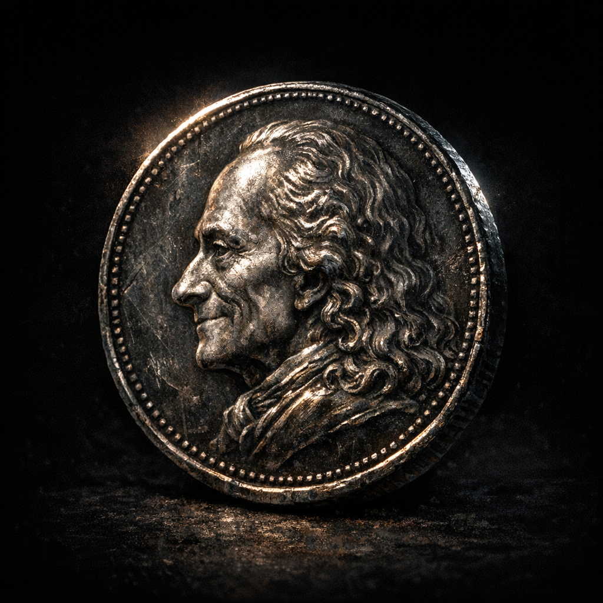

# Silver Coin with Voltaires face on it

#item #currency #vanity

## Summary

A single silver coin bearing Voltaire’s face, listed in his D&D Beyond inventory. It may be a mundane novelty, a minted proof of status, or a magical token.

## What the Party Knows (in-play)

- Voltaire carries a coin with his face on it (per sheet inventory).

## Open Questions

- Who minted it (Voltaire, Cromash’s city, a cult, a fey court)?
- Is it a focus/token for [[Divine Rank 0]] style “belief mechanics,” or just a joke?
