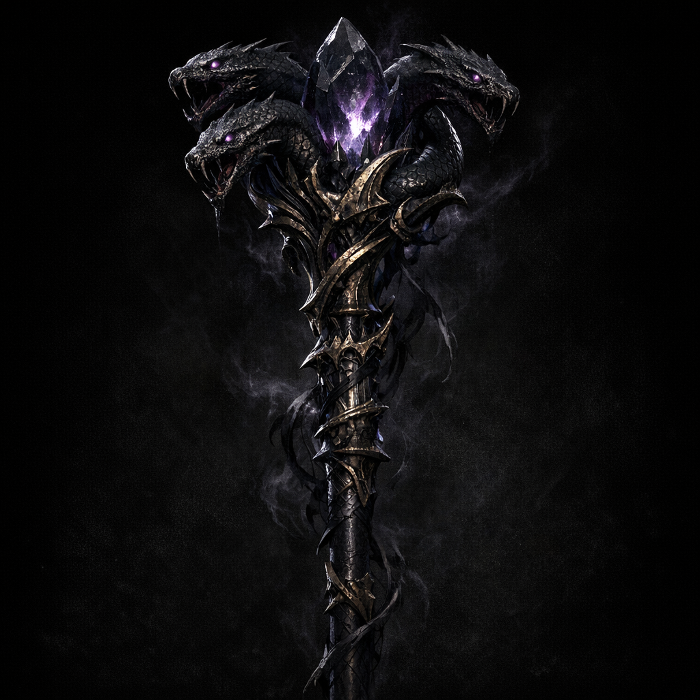

# Staff of Mother Hydra

#item #staff #mother-hydra #outsider-gold

## Summary

A powerful outsider-gold staff recovered from the heretic Abeil sect. At least one staff was offered to [[Shar]] and transformed into **[[Shadow's Fell]]**.

## Known Properties (notes; to verify)

- **Attunement**: Warlock, Cleric, Paladin
- **Value**: ~15,000 gp
- **Spell attack / save**: +1 spell attack, +1 spell save DC
- **Spell storing**: up to 2nd level
- “Speak and unders…” (truncated in notes; **[To verify]** whether this grants languages, command phrase, or sentience)
- “Allows leveling in Warlock under Hydra” (**[To verify]** mechanical meaning vs narrative “patron key”)

## Fate (one recorded)

- Offered to Shar; transformed into [[Shadow's Fell]].

## Open Questions

- Do multiple staves share a hive-linked consciousness, or are they discrete artifacts?
- What happens if a non-Hydra-aligned cleric attunes?
