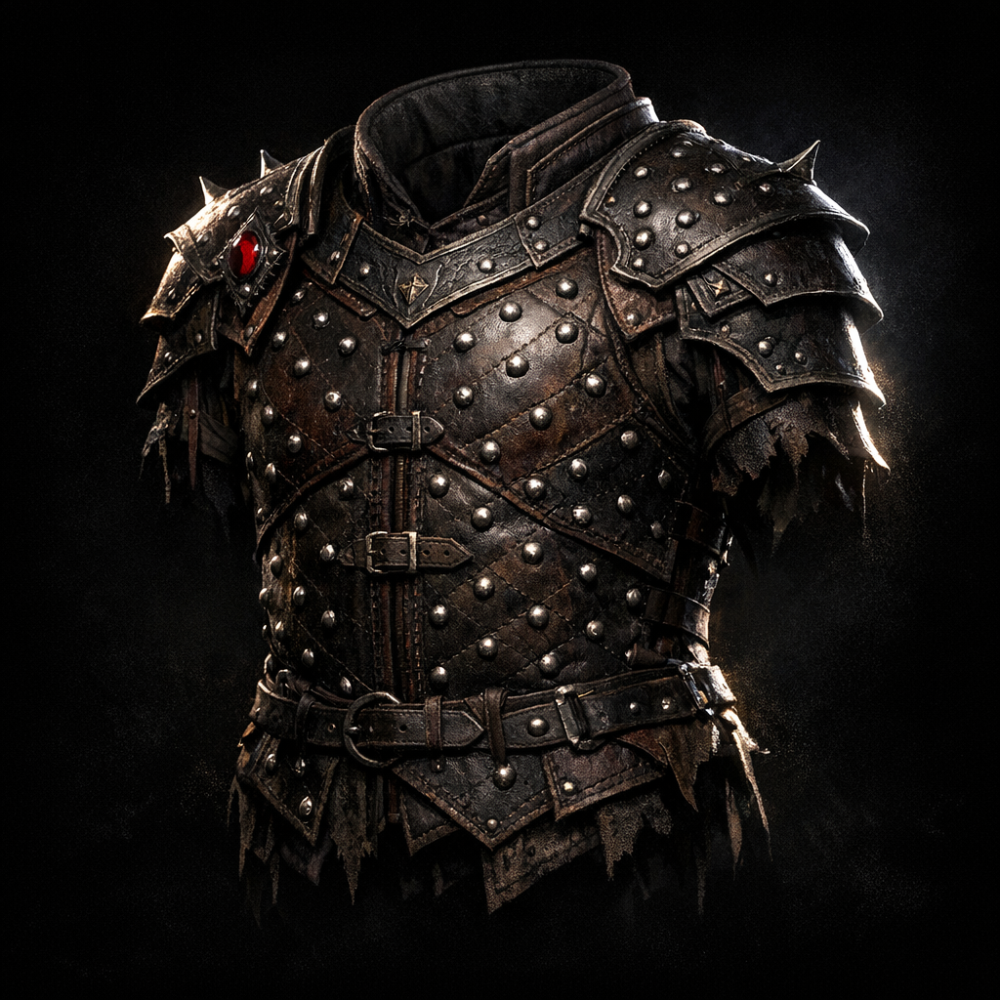

# Studded Leather, +2

#item #armor #magic-item

## Summary

Enhanced studded leather armor listed on Voltaire’s D&D Beyond inventory snapshot (**2026-01-25**).

## What the Party Knows (in-play)

- Voltaire owns/wears a +2 studded leather armor (per sheet inventory).

## Mechanics (sheet-derived)

- Armor type: light (studded leather)
- Bonus: +2 (exact stacking/attunement assumptions are table-dependent).

## Open Questions

- Is the +2 bonus purely AC, or does it include stealth/shadow properties at this table?
- Is it thematically tied to [[Shar]] / [[Shadowfell]], or simply enchanted gear?

