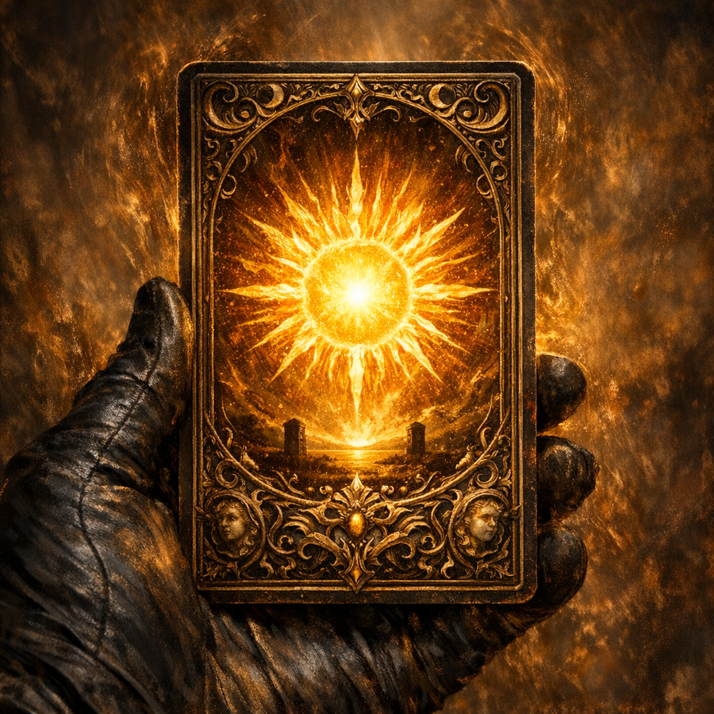

# The Sun Card

#item #artifact #deck-of-many-things

## Summary

The Sun Card is the specific draw from the [[Deck of Many Things]] that granted Voltaire tremendous advancement and a radiant “Sun Card Power.” It remains a central artifact in Voltaire’s apotheosis experiments.

## Known Effects (as recorded)

- **Radiant blast**: a powerful radiant attack (homebrew) used to vaporize a demon.
- **XP boon**: contributed to Voltaire’s advancement/multiclass pivot.
- **Creation catalyst**: Voltaire fed the Sun Card to a frog/toad, resulting in a Natural 20 “merge” that created the disciple [[Robin]] (exact metaphysics per table ruling).

## Open Questions

- Is the Sun Card consumed, duplicated, or spiritually “bound” after the disciple creation?
- What happens if the Sun Card is offered to a god/altar (e.g., Shar, Lathander)?
