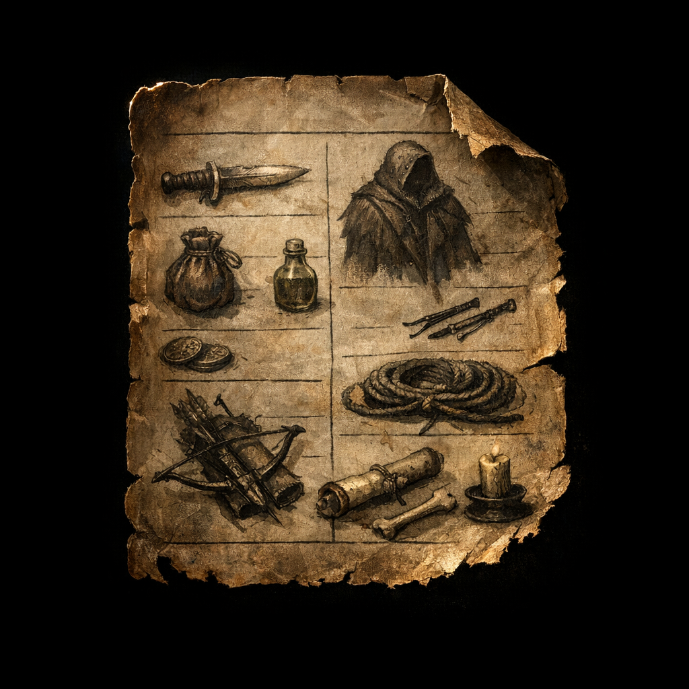

# Voltaire Inventory (Paper Sheet) — Rogue 8 snapshot

_Source: `Adventures/Voltaire's Notes/Character Sheet D&D Beyond/Imports/Voltaire Paper Character Sheet (extract).md`_

This is a **historical** inventory snapshot from Voltaire’s earlier paper character sheet. It is incomplete and should not be treated as current.

## Items explicitly noted (paper sheet)

- [[Robe of Eyes]]
- [[Onyx Hit Dagger of Returning +2]]
- [[Captain's Journals]] (x2)
- [[Nightgaunt Blood Vial]]
- [[Hellhound Ink Bricks]] (10 units)
- [[Nightgaunt Skin]] (noted as material; possession unclear)
- [[Word Stones]] (referent unclear)

## Inferred from stats/notes (verify)

- [[Headband of Intellect]] (from “INT 9/19”)
- [[Ring of Protection]] (from “cut off finger to remove ring” note; referent unclear)
