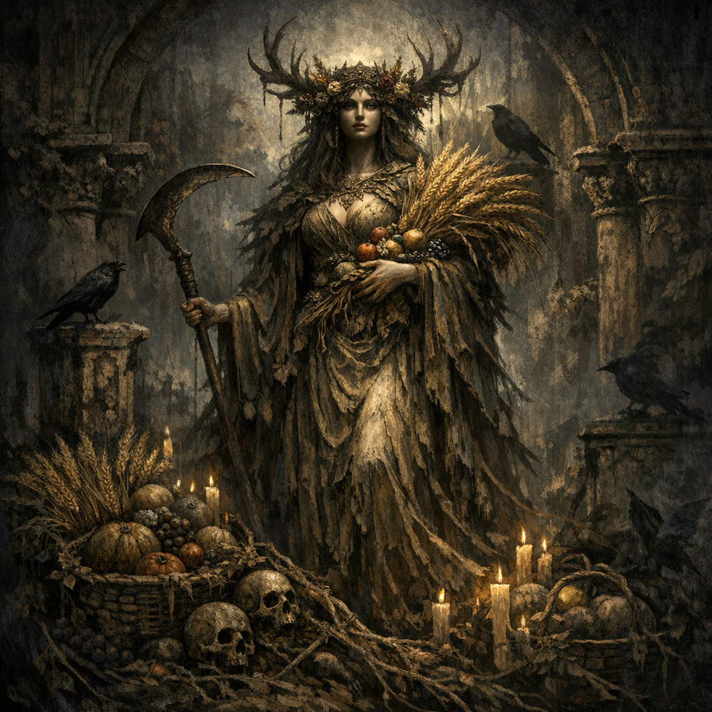

# Chauntea

#entity #deity #nature

## Summary

A nature/harvest-associated deity referenced as part of the triumvirate worship within the [[Anauroch Triumvirate Temple - Mythallar Complex]].

## Evidence (in campaign notes)

- The temple is described as dedicated to a triumvirate of [[Chauntea]], [[Shar]], and [[Eilistraee]] (see [[Anauroch Triumvirate Temple - Mythallar Complex]]).

## Open Questions

- What is Chauntea’s role in this campaign’s “strange harmony” with Shar and Eilistraee?
- Is the temple’s restoration/reconfiguration a sign of Chauntea’s influence returning, receding, or being subverted?

