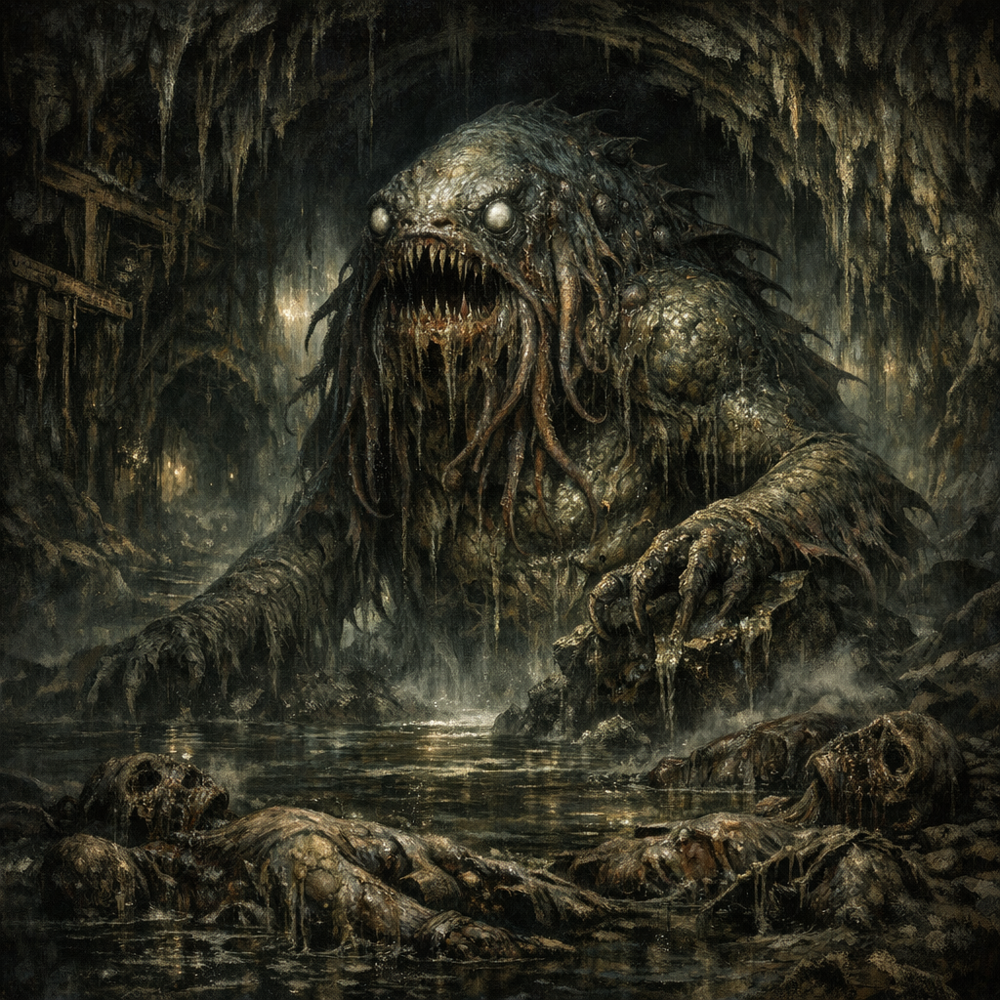

# Dagon

#lore #deity? #outsider #taint

## Summary

Dagon is referenced as an “outsider god” associated with the taint observed in corpses and tunnels around [[Palischuk]] and the [[Abeil Hive City]]’s older mine network.

## What the Party Knows (in-play)

- A Harper contact noted they had seen similar taint before “in relation to the outsider god Dagon.”
- The tainted gnome corpses and outsider-tech weapons were treated as a serious security concern by outside observers.

## Open Questions

- Is Dagon distinct from [[Mother Hydra]], an alias, a rival, or a broader umbrella for abyssal/outsider influence?
- What are the signs of Dagon-taint vs other planar infections?
- Does Dagon have worshippers on the surface, or is the influence arriving via deep tunnels and salvage?
