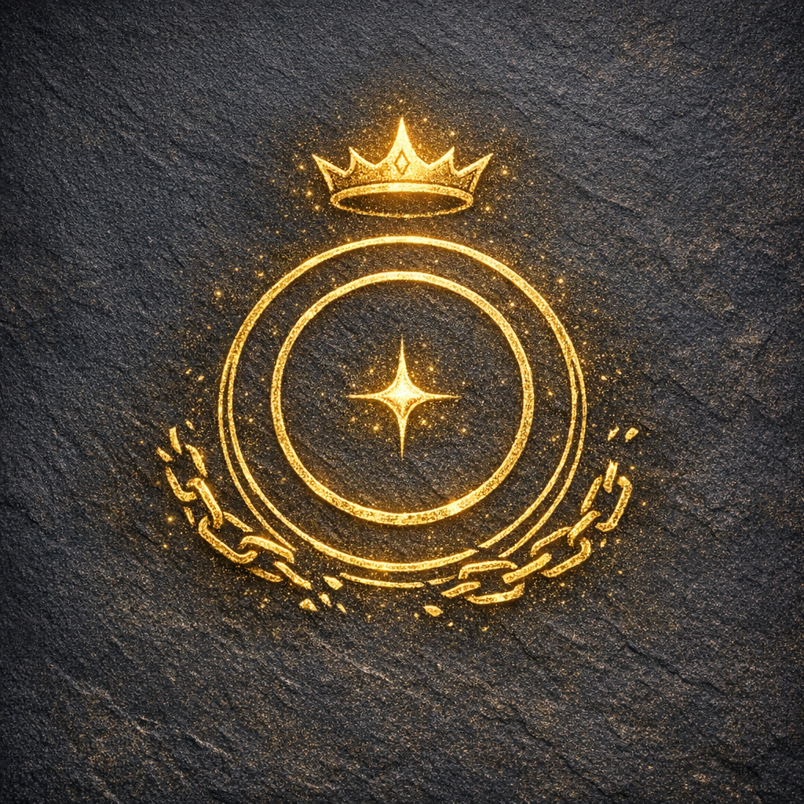

# Divine Rank 1

#lore #divinity #rules #voltaire

## Summary

**[Voltaire-only]** Voltaire advanced from [[Divine Rank 0]] to **Divine Rank 1** on 2026-06-06.

The advancement followed roughly six subjective months in the Feywild, during which Voltaire survived among Bloodweb spiders, darkened their territory through his influence, experimented with concept-memories near a tower crowned by “bright darkness,” and was accepted by roughly twenty Shadar-kai followers/initiates.

## Confirmed State

- **Current divine rank**: 1
- **Date gained**: 2026-06-06
- **Associated event**: Voltaire addressed roughly twenty Shadar-kai. Their leader whipped him, accepted his offered Shadow Dagger, and used it to carve V into his chest and forehead. The group admitted Voltaire into the tower, licked the blood from him, adorned/dedicated themselves to him, and became his followers/initiates.
- **Additional reward**: Inspiration
- **Experience reward**: +300 XP, raising Voltaire’s recorded total to **122,283 / 140,000 XP**
- **Divine symbol**: **V**
- **First confirmed congregation at Rank 1**: Roughly twenty Shadar-kai followers/initiates of the tower

## Claimed Domain and Next Sacred Act

- **[Voltaire-only | Player intent]** Voltaire has chosen or claimed the name **Domain of Unbecoming** for his emerging domain.
- **[To verify]** The DM/table has not yet confirmed that name as a mechanical divine domain, nor any portfolio, powers, or restrictions associated with it.
- **[Party/Voltaire-only | 2026-07-25]** Before the planned summit rite occurred, Voltaire remotely perceived the [[Temple of Blood]] through Cornholio/Tom’s eye “in reverse.” The temple turned black, his voice echoed “Machinations,” numerous eyes manifested around its walls and coalesced into V, and the oppressive atmosphere diminished as the temple was described as cleansed in Voltaire’s name.
- **[To verify]** Whether this was a Divine Rank 1 power, an effect of [[The Ink of Unbeing]] and the signed visitor book, a consequence of Cornholio’s link to Shar, a manifestation through the Robe of Eyes, or some combination.
- **[Voltaire-only | Declared, not yet resolved]** Voltaire intends to perform his **first divine rite** at the summit anti-light, acknowledging his divinity openly before the gods. He will pray to Shar and thank her for her role in his becoming; cut Shar’s circle/square/triangle geometry into his own flesh; let his blood fall upon the tower’s highest point; shape that blood into the followers’ sigil around the anti-light; and finally place **V** through the completed sigil.
- **[Voltaire-only | Intended petition]** By calling to the other marks he has placed, Voltaire seeks to (1) claim the tower and form it into his own realm—a middle ground between the Feywild and Shar’s realm—and (2) awaken a teleportation system linking his sigils.
- **[To verify]** The rite’s execution and outcome are not yet established. Its divine witnesses, costs, checks, recognised domain status, territorial extent, eligible teleportation anchors, access rules, and Shar’s response remain for the table to determine.
- **[Voltaire-only | 2026-07-25]** In the tower’s statue chamber, Voltaire destroyed dethroned Mask’s hollow statue, occupied its place for six subjective months, disguised himself as a statue, and repeated “As above, so below.”
- **[Voltaire-only]** Voltaire then granted Robin the **Blessing of V**, the first recorded attempt to bestow a named divine blessing on a follower. Its mechanical effect remains **[To verify]**.
- **[Voltaire-only]** Voltaire has now begun ascending toward the summit anti-light in giant-spider form.

## Mechanics To Establish

- Explicit benefits, resistances, immunities, senses, or divine actions granted by Rank 1.
- Whether Rank 1 recognises the proposed **Domain of Unbecoming** or requires a different formal domain.
- Any obligations, vulnerabilities, follower thresholds, or consequences attached to the rank.
- Whether the carved V marks and V divine symbol function mechanically.
- Whether Voltaire can sense, communicate with, empower, or grant magic to his Shadar-kai initiates.
- Whether the Blood Temple manifestation grants repeatable remote sight, voice, influence, consecration, or control through signed/marked individuals.
- What the **Blessing of V** grants Robin and whether Rank 1 permits Voltaire to bestow further blessings.
- Whether replacing Mask’s statue represented succession to a divine office, appropriation of a vacant domain, or a symbolic trial.
- Whether the first divine rite can establish a demiplane-like threshold realm, transform the existing tower, or merely mark it as claimed territory.
- Which existing sigils answer the rite, whether the V marks in Voltaire’s flesh or in altered minds count as anchors, and whether the network permits physical travel, communication, perception, or some narrower connection.
- Whether any imported 3.x divine-rank concepts apply; none are canon until the table establishes them.
