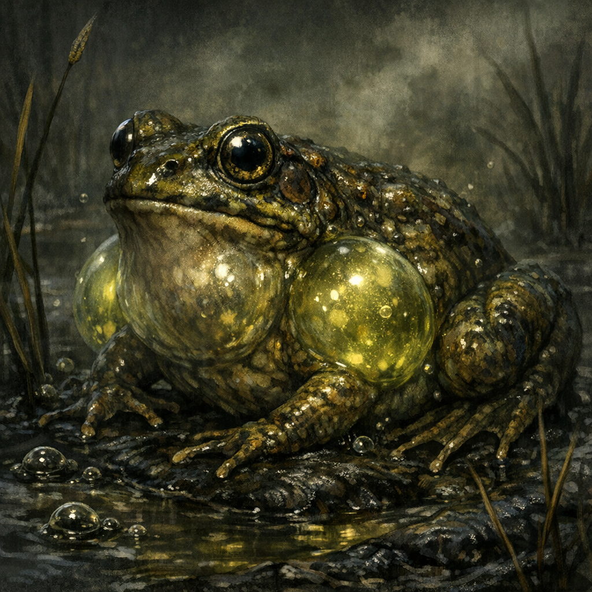

# Explosive Swamp Frogs

#lore #creatures #swamp

## Summary

Explosive Swamp Frogs are swamp-dwelling frogs that **store** the swamp’s volatile gases, **refine** them internally, and—when threatened—**self-detonate** as a defense.

First encountered/observed on **2026-01-25** in the [[Dellhalls Northeast Swamp]] (after traveling northeast from [[Dellhalls]]).

## What the Party Knows (in-play)

- They are a **variety of frogs** present in the swamp.
- They accumulate and refine the swamp’s explosive gases.
- When threatened, they can **explode**.
- En route to [[Palashaey]] (2026-01-25), the party discusses and experiments with safe capture/containment to learn how their gas-to-explosion process works.
- Voltaire asks [[Robin]] to attempt a “trade” conversation with the frogs for their secrets.
- The frogs relay local “history”: a **[[Green Dragon (Swamp Lake)]]** used to be in the lake until a **[[Gold Dragon (Westward Slayer)]]** killed it and flew off west.
- Cromash detonated a cluster of frogs with a spell; immediately after the blast, the swamp fell into **dead silence**. (Meaning unclear.)

## What Voltaire Thinks / Notes

- (Add Voltaire’s theories: alchemical capture, divine symbolism, weaponization, moral “grace” framing, etc.)
- Voltaire listens to the silence as a kind of “language,” and interprets it as evidence of **no local magical/godly presence**—only nature. (Inferred; verify in play.)

## Open Questions

- What triggers them: proximity, vibration, fear, sound, magic, heat?
- Blast radius and damage profile: concussive, fire, poison gas, shrapnel?
- Do they explode **once** (death) or can they vent in controlled “pops”?
- Can the refined gas be safely harvested (bladders, jars, ritual capture)?
- Can they communicate (animal speech, fey intelligence, spirit possession), and what do they value in trade?
