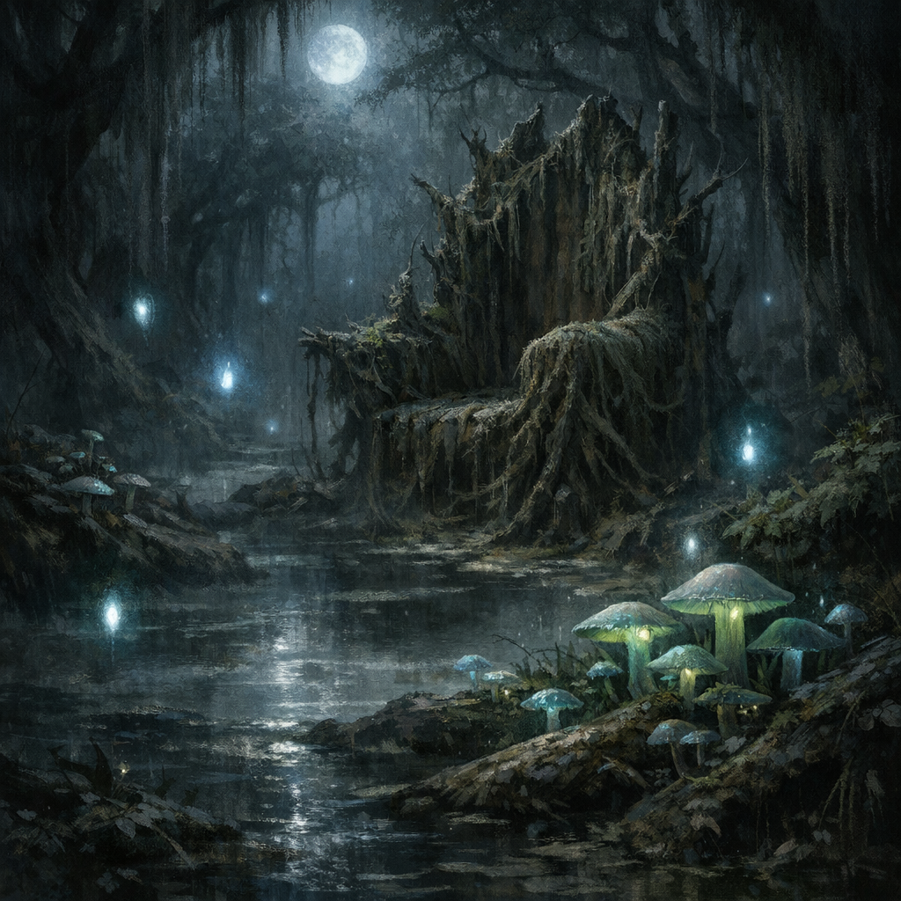

# Fae

#lore #fae

## Summary

Fae are beings tied to strange laws of story, bargain, and place. They are not merely “forest creatures” but embodiments of rules, contracts, and memory that can be rewritten—sometimes catastrophically.

## Relevance to Voltaire

- Voltaire was formerly a fae prince before being transformed into a variant human (see `Voltaire.md`).
- Voltaire has used [[The Ink of Unbeing]] to overwrite fae “theological anchors,” replacing memories of their gods with memories of Voltaire (direct conversion).

## Open Questions

- Which fae court/realm did Voltaire originate from?
- Are the converted fae still “fae” in nature after memory replacement?
