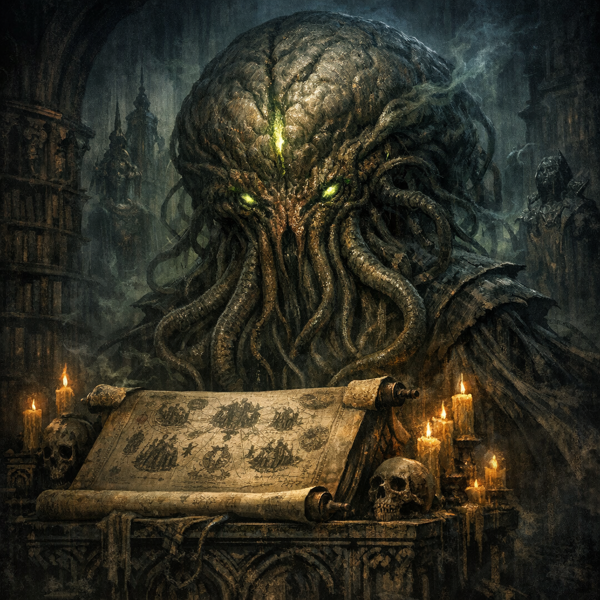

# Ilsensine

#lore #pantheon #scroll #mind

## Summary

Ilsensine is cited in notes as the purported author of a major scroll about pantheons of gods—studied in the [[Abeil Hive City]] library during the party’s downtime.

## What the Party Knows (in-play)

- Cromash spent multiple days reading a large scroll on pantheons of gods, described as “a copy of a text allegedly written by Ilsensine.”

## Open Questions

- Is this Ilsensine the illithid deity (as in some FR sources), or a different figure at this table?
- Was the scroll purely informational, or did it contain active memetic effects (given where it was stored and who was reading it)?
