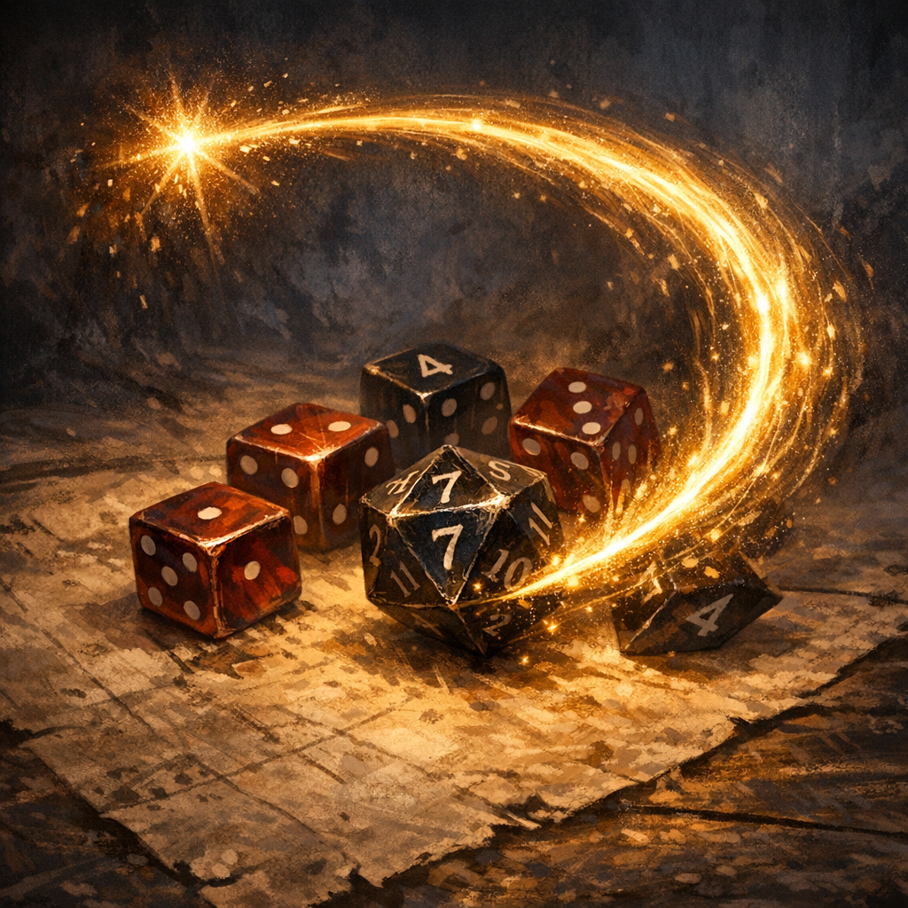

# Inspiration (House Rule)

#lore #rules #mechanics

## Summary

As of **2026-01-25**, the DM amended Inspiration: **spend 1 Inspiration to reroll any dice outcome**, including damage rolls.

## Rule (Confirmed)

- You may spend **1 Inspiration** to **reroll any roll after you see the outcome**.
- If the roll uses multiple dice (e.g., `3d6`), the reroll is the **entire pool** (reroll all `3d6`, not just one die).

## Examples

- **Scorching Ray damage**: if a ray hits and deals `2d6` fire damage, you can spend Inspiration after seeing the damage and **reroll the full `2d6`**.
- **Any d20 roll**: attack rolls, ability checks, and saving throws can be rerolled after the result is known.

## Open Questions (To Verify)

- Can multiple Inspiration points be chained on the same roll?
- Can Inspiration be used on enemy rolls that affect the party (e.g., an enemy’s crit)?
- Does the reroll replace the result unconditionally (standard), or can you choose the better/worse?
