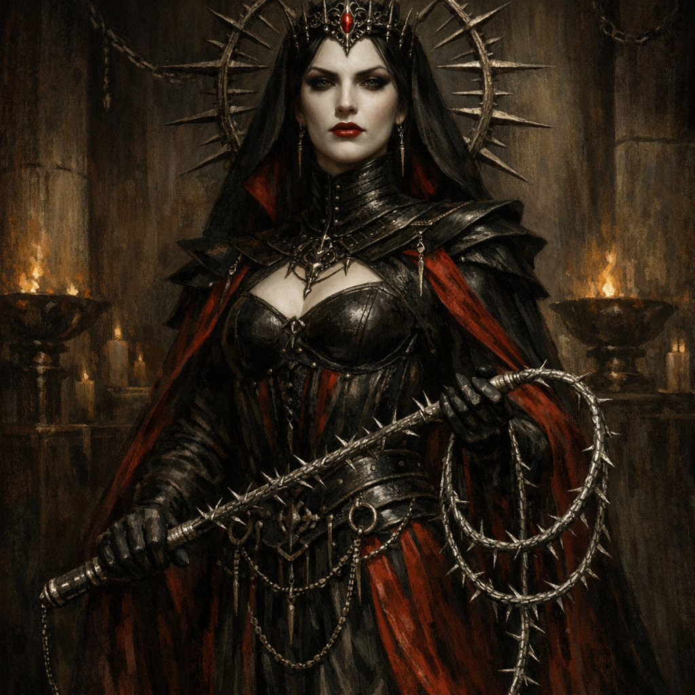

# Loviatar

#lore #deity #pain #ritual

## Summary

**[Voltaire-only]** A statue of **Loviatar** stands in the Shadar-kai tower’s divine chamber beside [[Shar]] and [[Mask]].

## Known in Play

- The three statues were understood to represent gods.
- The rite centred on the destruction and replacement of Mask’s hollow statue; Loviatar’s statue remained intact.

## Open Questions

- Why were Shar, Loviatar, and dethroned Mask grouped together?
- Did each statue represent a god, a portfolio, a trial, or an available divine office?
