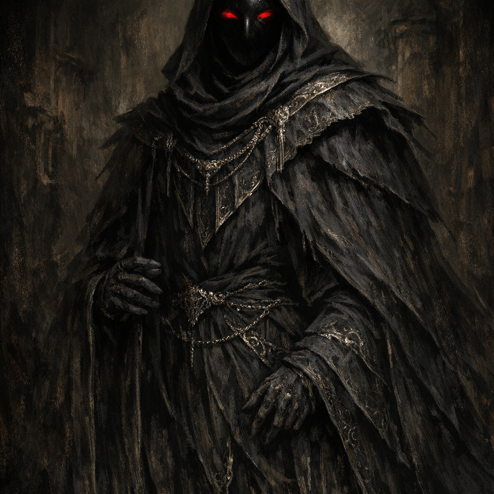

# Mask

#lore #deity #shadow #thieves

## Summary

**[Voltaire-only]** Mask is a god represented in the Shadar-kai tower’s statue chamber. His statue wore a velvet-black mask with red eyes, and the session notes identify him as **dethroned**.

## Statue-Room Rite — 2026-07-25

- Mask’s statue stood alongside statues identified as [[Shar]] and [[Loviatar]].
- Voltaire accepted the Shadar-kai’s apparent invitation, exposed the V carved into his chest, and told them to begin.
- After the chamber pulsed overwhelmingly for twenty-four seconds, everyone except Voltaire fell to their knees.
- Voltaire commanded, “Rise,” then chiselled Mask’s statue in rhythm while the Shadar-kai beat a ritual rhythm.
- The statue crumbled when Voltaire reached its face and proved to be hollow.
- **[Inferred]** Voltaire considered the hollow statue emblematic of Mask’s dethronement or absent divinity.
- Voltaire placed the remaining rubble onto his [[Robe of Eyes]] and occupied the statue’s place for six subjective months.

## Open Questions

- Why was the statue of a dethroned god preserved beside Shar and Loviatar?
- Did destroying the statue transfer a title, vacancy, domain, curse, or divine claim to Voltaire?
- What became attached to the rubble now carried on the Robe of Eyes?
