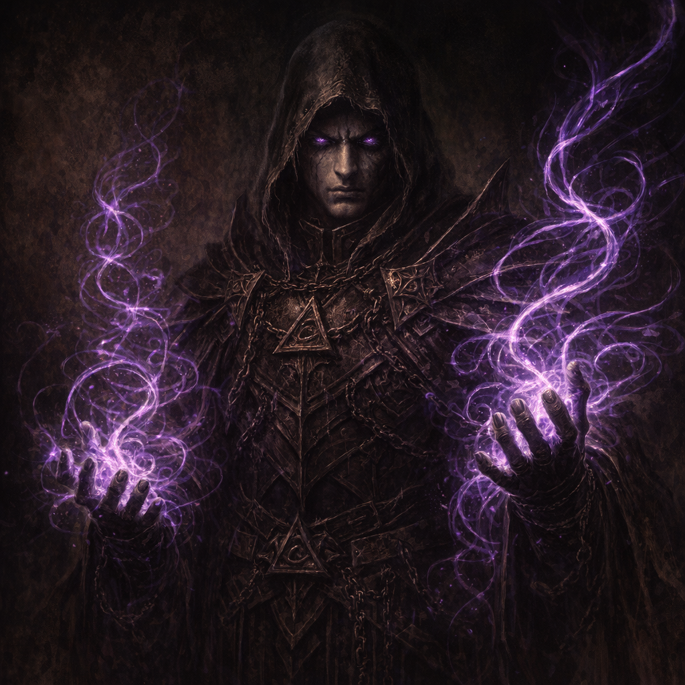

# Nisadrin (Bound Ones)

#lore #warlock-knights #arcane-order #to-verify

## Summary

“**Nisadrin**” (also called the **Bound Ones**) are referenced in Warlock Knights archive material as arcane casters sworn in fidelity to the Knights. They are described as wizard-priests bound via a special pact with [[Telos]], with elite members recruited as **Luminaries**. Their power is described as manifesting as **glowing purple tendrils**. **[To verify]** how accurate this is and what the Bound Ones’ role is in the city’s security and mining.

## What Voltaire Learned (2026-02-21)

- **[Voltaire-only | To verify]** “Nisadrin / Bound Ones” are arcane casters sworn to the Warlock Knights.
- **[Voltaire-only | To verify]** They formed a special pact with [[Telos]].
- **[Voltaire-only | To verify]** They are “wizard priests”; the most powerful are “Luminaries.”
- **[Voltaire-only | To verify]** Their powers manifest as **glowing purple tendrils**, which Voltaire reports he has seen before (context unknown).

## Open Questions (To Verify)

- Where are Nisadrin trained, housed, and commanded from (tower, enclave, undercity)?
- What does the pact require (oaths, sacrifice, ironfelt contact, dream communion)?
- Are purple tendrils a unique signature (Nisadrin) or a broader arcane phenomenon at this table?
