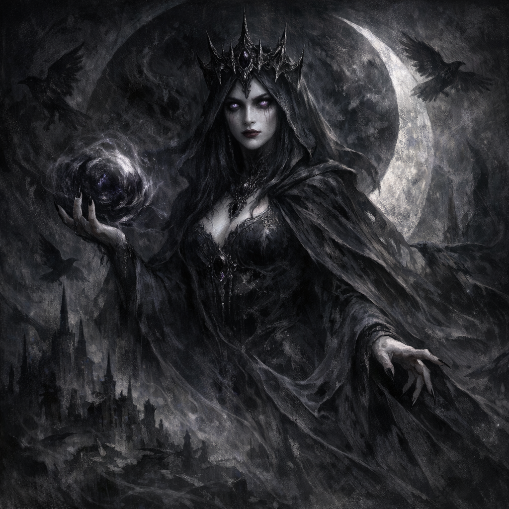

[Shar | Forgotten Realms Wiki | Fandom](https://forgottenrealms.fandom.com/wiki/Shar)

#entity #deity #shadowfell

**Titles**: Lady of Loss, Mistress of Night, The Greater Darkness
**Portfolio**: Darkness, Night, Secrets, Loss, Forgetfulness
**Domain**: The Shadowfell

[[Shar]] is a greater deity and one of the most ancient, powerful, and enigmatic beings in the Faerûnian pantheon. She is the embodiment of the void and the primordial darkness, a goddess who presides over secrets, hidden knowledge, and the comfort of forgetting. Her motivations are often subtle and manipulative, and she is known to find amusement in the intricate sorrows and choices of mortals. She has become the pivotal figure in [[Voltaire]]'s current story arc.

## Relationship with the Party

Shar's connection to the party is unusually deep and multifaceted, extending far beyond her recent encounter with [[Voltaire]].

*   **[[Cornholio]], The Consort**: Shar has a long-standing (two years in real-time) relationship with the Echo Knight [[Cornholio]], whom she has claimed as her consort and "favourite mortal." She has gifted him powerful artifacts like the **[[Shadow's Weave]]** and **[[Shadow's Fell]]**, and he holds a unique and privileged position in her esteem.

*   **[[Cromash]], The Antagonistic Patron**: In a bizarre twist, the Paladin of Grûumsh has become a "celebrity" in the Shadowfell. He uses his magical weapon to send creatures and items he deems "dumb shit that Shar hates" into her realm as a form of divine trolling. This constant stream of unwelcome "donations" has made him a well-known figure to her denizens.

*   **[[Yennefer]], The Scorned**: Shar has had a direct and antagonistic interaction with [[Yennefer]], gifting her the **[[Whip of Flagellation]]** for "self-flagellation" and a perfume with a sarcastic note. This has established a relationship of divine scorn.

## The Trial of Voltaire

When [[Voltaire]] was unexpectedly transported to her realm, Shar did not destroy him. Instead, she was met with an audacious proposal: an invitation to a game based on his newly-titled book, **[[Machinations & Actions - Player's Handbook]]**, to be hosted in his mind and involving a high-stakes bet.

Intrigued by this unique mortal—who carries her ceremonial dagger (see [[Sharite Ceremonial Dagger]]), holds the latent knowledge of the [[Book of Vile Darkness]] and [[Book of Exalted Deeds]], and is connected to her own consort—Shar made a counter-offer:

1.  **She accepts the premise of a "game and trial."** She is willing to engage with his proposal, seeing it as a unique opportunity.
2.  **She personally declines to participate.** A goddess will not be a player in a mortal's mind-game, maintaining her divine aloofness.
3.  **She will facilitate the event.** In a significant move, she has agreed to deliver [[Voltaire]]'s "invitations" to the other proposed participants, including [[Glasya]] and the party. She is the cosmic enabler for his chaotic event.

### The Symbolic Framework

Instead of a simple game, Shar has reframed the event as a divine **trial**. She provided [[Voltaire]] with a cryptic image of three symbols, implying the structure and themes of the challenges to come:
*   **Circle**: Heaven / Void / 1
*   **Square**: Earth / Thought / 2
*   **Triangle**: Human Beings / Intention / 3

These symbols suggest the trial will be a structured, metaphysical test of Voltaire's nature, his ability to manifest his will, and his connection to the fundamental forces of creation.

## Inferred Motivations & Interests

Shar's engagement with Voltaire seems driven by a profound and calculating curiosity. The likely objects of her interest include:

*   **Voltaire's Nature**: His unique state as a fallen Fae, a fractured human, and a being of High Intelligence but catastrophically Low Wisdom makes him a fascinating anomaly.
*   **The Cosmic Knowledge**: The latent knowledge of the [[Book of Vile Darkness]] and [[Book of Exalted Deeds]] within him is a secret of unimaginable value.
*   **The Sharite Dagger**: The fact that he carries one of her ceremonial weapons (see [[Sharite Ceremonial Dagger]]) is a mystery she likely intends to solve.
*   **[[The Ink of Unbeing]]**: This power, linked to the "House Sharimythal," operates directly within her portfolio of memory and loss. His potential as "The Inephemeral Scribe" makes him a figure of immense interest.
*   **The Game Itself**: A mortal attempting to codify the rules of reality and inviting her to play is a novel form of worship or blasphemy that she cannot ignore.

## Feywild Tower Manifestation (2026-06-06)

- **[Voltaire-only]** Voltaire perceived Shar’s influence in a darkening region of the Feywild and followed it to a mountain tower crowned by a sphere of “bright darkness.”
- **[Voltaire-only]** While using the voidbone pen to combine the concepts of darkness, light, and life in nearby dark creatures, Voltaire’s own life force began to drain. He understood that Shar was stopping him from creating a new form of life.
- **[Voltaire-only]** During the experiment he perceived Shar as an immense human woman with **pale/white skin** and knew the figure was Shar.
- **[To verify]** It is not yet clear whether this was Shar’s human form, an aspect/avatar, a vision, a symbolic memory, or an interpretation imposed by the concept-memory experiment.

## Tower Statue Chamber (2026-07-25)

- **[Voltaire-only]** The Shadar-kai led Voltaire into a chamber containing divine statues identified as Shar, [[Loviatar]], and dethroned [[Mask]].
- The rite focused on Voltaire destroying Mask’s hollow statue and occupying its place for six subjective months; Shar’s statue remained intact.
- **[To verify]** Whether the chamber belongs to Shar, judges potential divine successors, preserves dethroned offices, or stages a different symbolic trial.

## Voltaire’s First Divine Rite — Declared Intent (2026-07-25)

- **[Voltaire-only | Declared, not yet resolved]** Voltaire intends to begin his first openly acknowledged divine rite by praying to Shar and thanking her for her part in his becoming.
- He plans to inscribe Shar’s circle/square/triangle geometry into his own flesh before using the resulting blood to form his followers’ sigil around the tower’s summit anti-light.
- Voltaire’s gratitude does not concede the tower to Shar: he intends to place V through the blood-sigil, claim the tower as his own threshold realm, and awaken a linked teleportation system.
- **[To verify]** Whether Shar understands this as gratitude, worship, succession, theft, blasphemy, an accepted move in their game, or several of these at once.
