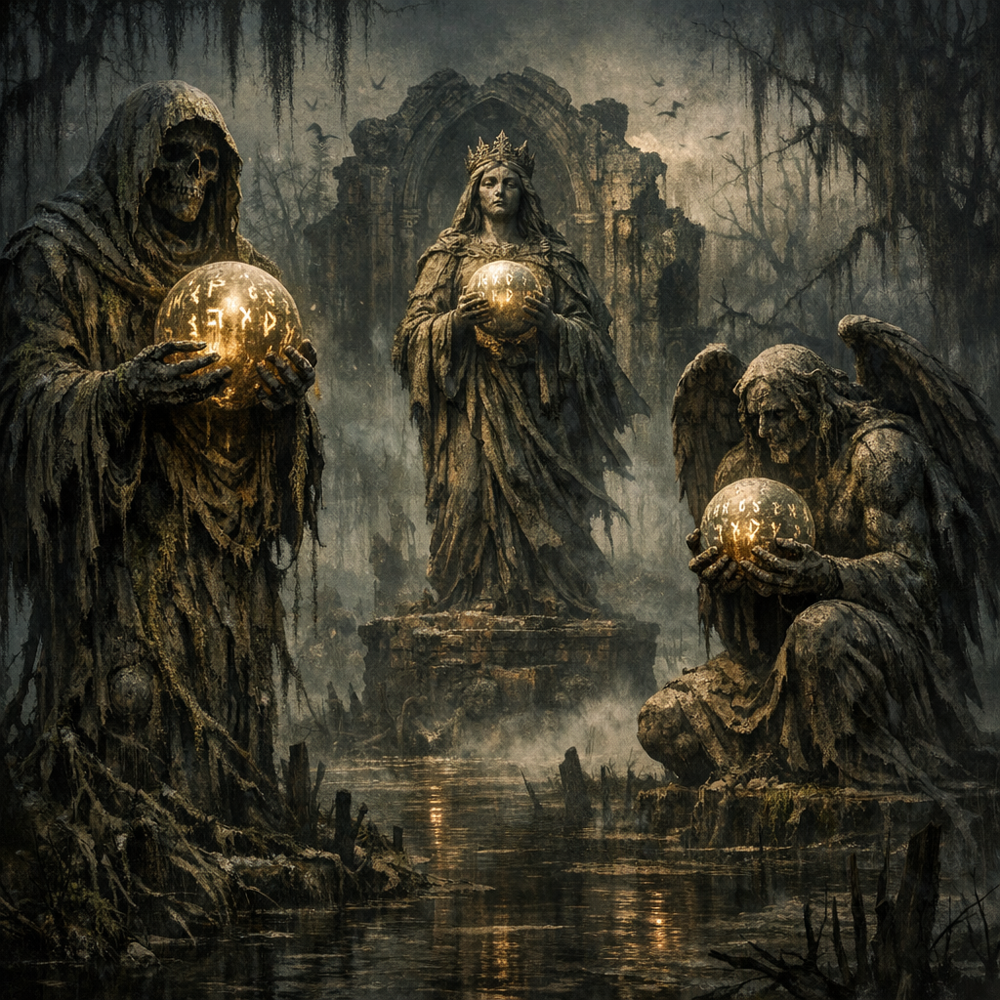

# Swamp Statues - Orb Scripture

#lore #quest #swamp

## Summary

Voltaire’s paper-sheet notes record a “Statue Side Quest” in a swamp: three ancient statues connected to “orb scripture”.

## Party Knowledge (paper sheet)

- Discovered **3 ancient statues** in the swamp.

## Voltaire-Only Notes (paper sheet)

- **[[D'endrrrah]]** (“Vampire of Lust”) — had hidden orb scripture
- **[[Nyarlathotep]]** (“Muscular Tendrils”) — missing orb scripture
- **[[Hastur]]** (“Yellow King of Swamp”) — missing orb scripture

## Open Questions

- What is “orb scripture” (text inscribed on an orb, a fragment of a larger artifact, or a ritual key)?
- Where are the two missing orb scriptures now?
- How does this connect to Voltaire’s later relic/ink work?
