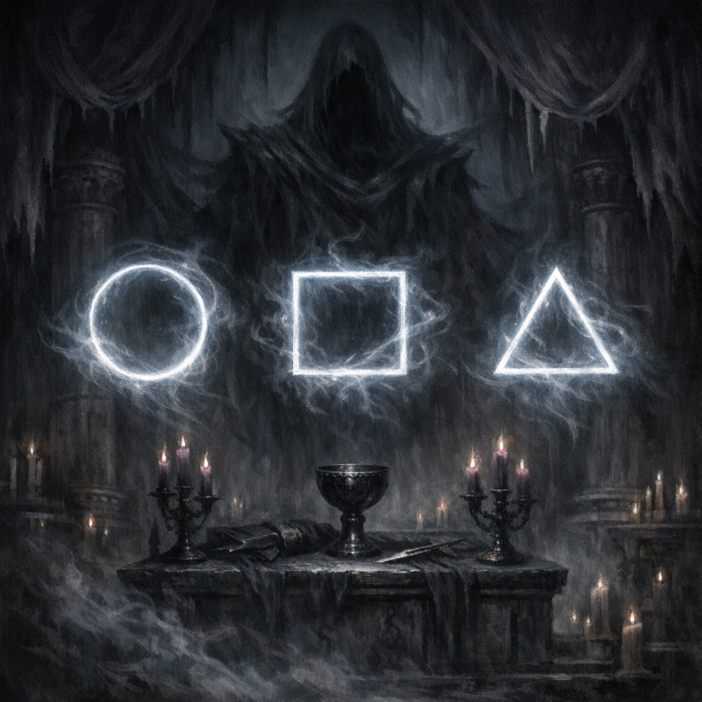

# The Trial of Shar

#lore #shar #trial

## Summary

A structured “trial” framework associated with [[Shar]] and Voltaire’s proposed game/bet, intended to test Voltaire (and potentially others) through symbolic, metaphysical challenges.

## What’s known

- Shar accepted the premise of a game/trial but declined to participate as a player (per existing notes).
- The trial has been associated with a symbolic framework (circle/square/triangle) in prior lore.
- **[Voltaire-only] (planned framing)** Voltaire proposed hosting the trial inside [[Head-Space]] using his rulebook artifact [[Machinations & Actions - Player's Handbook]].

## Why it matters

- It’s a central arc for Voltaire’s current story: proving, weaponizing, or surviving his nascent divinity.

## Open Questions

- What are the explicit rules, stakes, and failure conditions?
- Who are the invited participants (party, [[Glasya]], others)?
- Is the trial meant to crown, break, or bind Voltaire?
