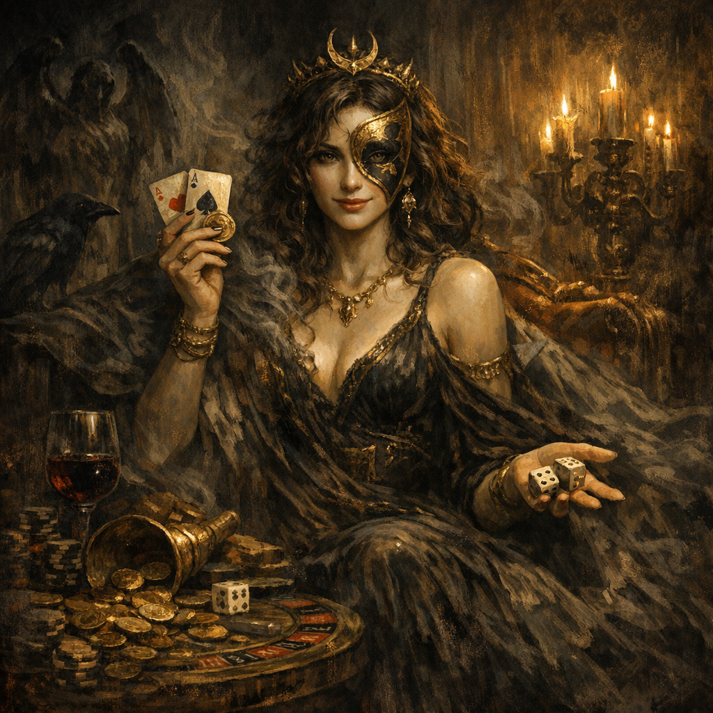

# Tymora

#entity #deity #luck

## Summary

The Faerûnian Goddess of Good Fortune, referenced in the Codex as the twin of [[Beshaba]]. Her presence in the notes is largely contextual: Voltaire’s story is repeatedly shaped by wagers, artifacts of chance, and high-stakes gambles.

## Evidence (in campaign notes)

- Referenced in [[Beshaba]] as Beshaba’s twin (good fortune vs misfortune axis).

## Relationship to Voltaire (inferred)

- Voltaire’s life was radically reshaped by the [[Deck of Many Things]]—a pure instrument of chance. Tymora’s “shadow” (good outcomes) and Beshaba’s “bite” (catastrophic outcomes) both echo through his arc.

## Open Questions

- Has Tymora been directly encountered or invoked at this table?
- Is Voltaire’s luck a divine tether, a curse, or simply his narrative momentum?

