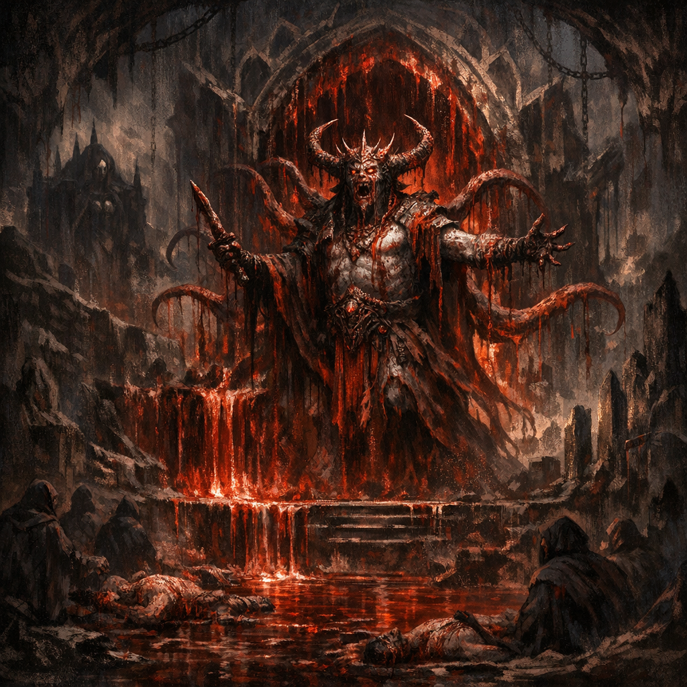

# Uvash

#lore #blood #demiplane #cult

## Summary

Uvash is referenced as a “mad blood god” connected to a blood-associated demiplane/portal complex discovered in tunnels beneath [[Palischuk]]. The collapse of that demiplane (triggered by Cromash) had cascading effects, including the restoration of a lost shrine to [[Shar]] and disturbances among blood cults on the Prime.

## What the Party Knows (in-play)

- The party found a hidden portal to a blood-linked demiplane “associated with a mad blood god Uvash.”
- Cromash thrust a Shar-aligned weapon through the open portal and killed a star vampire, collapsing the demiplane into the [[Shadowfell]].
- Afterward, a Harper reported that multiple blood cults “lost their powers” and began infighting.

## Open Questions

- Was Uvash destroyed, displaced, or merely cut off from worshippers?
- Why did the demiplane’s collapse restore a Shar shrine—was it built on top of an older Sharran site, or did Shar seize the vacuum?
- What else fell into the Shadowfell when the demiplane collapsed?
