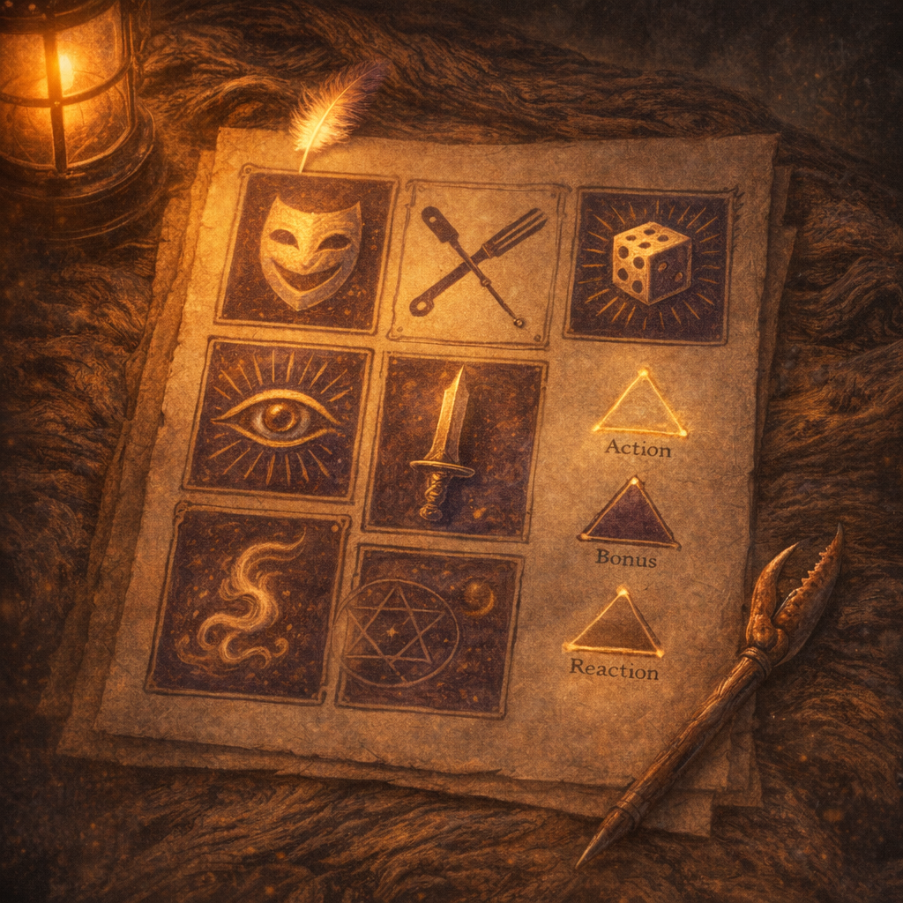

# Voltaire Quick Reference (Actions & Abilities)

#lore #meta #voltaire #cheatsheet #actions

> Table note: your character sheet export tags a couple spells as `PHB-2024`. If Lachlan is using 2024 wording, his table text/rulings override anything here.

## At a Glance (Current Snapshot)

- **Level**: 13 — Rogue 5 (Thief) / Warlock 8 (Archfey) (`Codex/Characters/Party/Voltaire.md`)
- **Spellcasting**: CHA, **DC 18**, **Spell attack +10** (`Codex/Powers/Voltaire Spell List (D&D Beyond 2026-01-25).md`)
- **Big numbers** (from sheet): **Stealth +14**, **Perception +9**, **Sleight of Hand +9**, **Acrobatics +9**
- **Key “buttons”**: `Disguise Self` at-will; `Suggestion`; `Hypnotic Pattern`; `Invisibility` / `Greater Invisibility`; `Misty Step`; `Misty Escape`; `Shadow Blade`; `Uncanny Dodge`; `Lucky`

## Action Economy (Cheat Grid)

### Actions

- **Social / Control**: `Suggestion`, `Hypnotic Pattern`, `Disguise Self` (cast), `Greater Invisibility` (cast)
- **Position / Utility**: `Invisibility` (cast), lockpick/trapwork (normally), general “Use an Object” (normally)
- **Invocation**: `Feral Transformation` (1/long rest) — 1 action

### Bonus Actions

- **Rogue**: `Cunning Action` (Dash/Disengage/Hide)
- **Thief**: `Fast Hands` (special uses below)
- **Spells**: `Misty Step`, `Shadow Blade` (cast), `Hex` (if you run it), `Expeditious Retreat` (cast)

### Reactions

- **Defense**: `Uncanny Dodge`
- **Escape**: `Misty Escape` (1/short rest, triggers when you take damage)

### Concentration (you can only run one)

Common contenders you’ll actually fight over:
- `Greater Invisibility` (1 min)
- `Invisibility` (1 hour)
- `Hypnotic Pattern` (1 min)
- `Suggestion` (up to 8 hours, table-dependent wording)
- `Shadow Blade` (1 min)
- `Hex` (1 hour)

## “Fun To Experiment With” — Exact Mechanics & Play Notes

### Mask of Many Faces → Disguise Self at-will

- **Mask of Many Faces (Invocation)**: You can cast `Disguise Self` **at will** without expending spell slots.
- **Disguise Self** (illusion; **1 action**; Self; V,S; **1 hour**):
  - Changes **appearance** (incl. clothing/armor/weapons visuals) up to about **1 foot** of height difference.
  - Doesn’t change your actual body; **touch/physical interaction** can reveal the mismatch.
  - A creature can use its action to **inspect** you and make an **Investigation check vs your spell save DC** to see through it.

**Good experiments (city play)**:
- Run “multiple Voltaire” (different masks) to create alibis and false narratives.
- Become “paperwork” (clerk, inspector, messenger) to make your lies feel official.

### Fast Hands (Thief) + props

- **Fast Hands (Thief)**: You can use the bonus action from `Cunning Action` to:
  1) Make a **Sleight of Hand** check, or
  2) Use **thieves’ tools** to disarm a trap/open a lock, or
  3) Take the **Use an Object** action (typically nonmagical object interaction/activation).

**Practical implication**: you can “write the scene” with objects while still moving/hiding.

### Skill spikes (and what to do with them)

- When the DM calls for it, roll `d20 + skill mod`.
- **Expertise** doubles your proficiency bonus for that skill (your sheet shows Expertise on **Stealth** and **Perception**).
- **Passive Perception** is typically `10 + Perception mod` (your sheet shows **19**).

**Practical implication**:
- You’re built to **spot** the trap *and* be the person who can **solve** it without stopping the scene.

### Suggestion (DC 18) — “the reasonable thing”

- **Suggestion** (typically: **1 action**, 30 ft; V,M; **WIS save**; **concentration up to 8 hours**):
  - Target must be able to **hear and understand** you.
  - On a failed save, it pursues a course of action you describe that sounds **reasonable**.
  - Usually ends early if you or your allies **damage** it.
  - Can’t be “obviously directly harmful” (e.g., “stab yourself” doesn’t fly).

**Good experiments**:
- “Introduce us to the person who can approve this order today.”
- “Walk us through the proper procedure and stamp it as urgent.”

### Hypnotic Pattern (DC 18) — crowd reset

- **Hypnotic Pattern** (**1 action**; 120 ft; **30-ft cube**; S,M; **WIS save**; **concentration up to 1 minute**):
  - Creatures who can **see** it make the save.
  - On a fail: **charmed**, **incapacitated**, **speed 0**.
  - Ends for a creature if it takes **any damage**, or someone uses an **action** to shake/slap it out.

**Good experiments**:
- Nonlethal “pause” button to prevent escalation in markets/courts.

### Invisibility / Greater Invisibility

- **Invisibility** (**1 action**; Touch; V,S,M; **concentration up to 1 hour**):
  - Ends if the target **attacks** or **casts a spell**.
- **Greater Invisibility** (**1 action**; Touch; V,S; **concentration up to 1 minute**):
  - **Does not end** when the target attacks or casts spells.

**Practical implication**:
- `Greater Invisibility` is your “do crime in daylight” version.

### Misty Step / Misty Escape

- **Misty Step** (**bonus action**; Self; V): teleport up to **30 ft** to a space you can see.
- **Misty Escape** (Archfey; **reaction**; **1/short rest**):
  - Trigger: **when you take damage**.
  - Effect: turn **invisible** and teleport up to **60 ft** to a space you can see.
  - Invisibility ends at the start of your next turn **or** if you **attack/cast a spell**.

**Good experiments**:
- Treat your HP as a tripwire: “if touched, I vanish.”

### Feral Transformation (Invocation) — “I brought a body”

- **Feral Transformation** (**1 action**; **1/long rest**):
  - Transform into **Dire Wolf**, **Giant Spider**, or **Giant Octopus** (polymorph-like).
  - You keep **INT/WIS/CHA** and your **saving throw proficiencies**; gain the creature’s physical stats.
  - You can still **speak**; per your sheet text, you can cast spells with **only verbal components**.
  - Duration: **1 hour** or until the form hits **0 HP** (then you revert; overflow damage carries over).

**Good experiments**:
- Giant Spider for vertical city movement / infiltration.

### Shadow Blade + Sneak Attack

- **Shadow Blade** (**bonus action**; Self; V,S; **concentration up to 1 minute**):
  - Conjures a blade that deals **2d8 psychic** on a hit (upcasts for more).
  - In **dim light or darkness**, you have **advantage** on attacks with it.
- **Sneak Attack (3d6)**:
  - **Once per turn** when you hit with a **finesse or ranged** weapon:
    - Add **+3d6** if you have **advantage**, **or**
    - If an enemy of the target is within **5 ft** of it and you don’t have disadvantage.

**Practical implication**:
- Your “night work” damage plan is: `Shadow Blade` → advantage → Sneak Attack.

### Uncanny Dodge

- **Uncanny Dodge** (**reaction**): when an attacker you can **see** hits you with an attack, halve the attack’s **damage**.

### Lucky + Inspiration (House Rule)

- **Lucky** (feat; **3 points/long rest**):
  - Spend 1 point to roll an **extra d20** on an attack roll / ability check / saving throw; choose which d20 to use.
  - Or when an attack roll is made **against you**, you roll a d20 and choose whether the attacker uses their d20 or yours.
  - Timing: after the roll, before the outcome is determined.
- **Inspiration house rule** (`Codex/Lore/Inspiration (House Rule).md`):
  - Spend **1 Inspiration** to reroll **any** dice outcome after seeing it (including rerolling an entire damage pool).

**Practical implication**:
- You have two layers of narrative leverage: “I get one more try” (Inspiration) and “I brought my own probability” (Lucky).

## Mundane Props (Fast Hands-friendly)

> Exact item text can vary by table/edition; treat this as “common 5e usage.”

- **Ball Bearings (bag)**: cover a **10-ft square**; moving through requires a **DC 10 Dex save** or fall **prone** (careful movement at half speed can avoid).
- **Oil (flask)**: splash creature/area; if ignited it burns briefly (damage/timing per DM).
- **Hooded Lantern**: bright light 30 ft, dim light 30 ft more; can shutter.
- **Rope / Thieves’ Tools**: rope for rigging/climbs; thieves’ tools for locks/traps (Fast Hands can enable bonus-action lock/trap interaction).

## Session Recipes (Palashaey / City Play)

### “Procurement as a heist”

1) `Disguise Self` into an “authorized” role.
2) Use `Suggestion` to route you to the one person who can approve delivery *today*.
3) If it goes loud: `Hypnotic Pattern` → walk away like it was always permitted.

### “I refuse consequences”

1) Take the risky move.
2) If hit: `Misty Escape` behind cover.
3) Next turn: `Cunning Action: Hide` or `Misty Step` into a new lane.

### “Night work”

1) `Shadow Blade` (bonus action).
2) Create advantage (darkness / stealth / ally adjacency) → Sneak Attack.
3) `Uncanny Dodge` the first real hit that lands.

## Maintenance (Keep Accurate)

- This document is a **player cheat-sheet**, not a rules authority.
- If Voltaire’s sheet updates, update:
  - DC / spell attack
  - Sneak Attack dice
  - resource counts (Lucky points, rests for features, slots)
  - the “Key buttons” list

