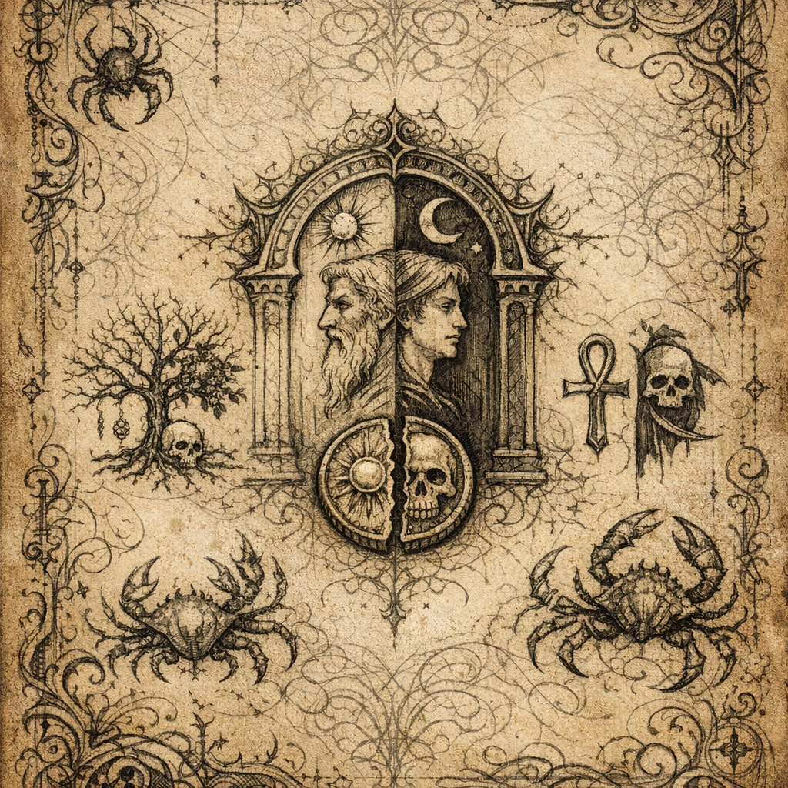

# Voltaire's Divine Blueprint

#lore #voltaire #divinity #duality

## Summary

A set of metaphysical/theme notes captured during a “housekeeping session” (source label in import: “7.9.25” — date format ambiguous). These notes outline a conceptual roadmap for Voltaire’s ascent: **duality**, **life/death**, and subtle “pure” leverage rather than raw power.

## Transcribed Notes (imported)

- “The Marginalia is creeping, scuttling. It talks to me in riddles of crustation.”
- “Forgone are the whispers of the mind / The levers of experience pull / Converting concept to experience / Mortality to divinity”
- **Tymora (Luck)**:
  - Domain of duality for Voltaire
  - “In the middle of duality”
  - Wall of the Faithless (Dead Three reference noted)
- Additional entities/concepts listed:
  - Myrkul
  - Cyric
  - Kelemvor
  - Fugue Plane / Limbo
  - “Focus on a part of existence in life and death and this crystal sphere. Start with a concept of real duality and grow from there.”
- “Janus (Roman)”
- “Look into Archfeys for patron”
- Margin note: “It is pure / Not powerful / … Janus concept”

## Interpretation (Voltaire-facing, not guaranteed canon)

- Voltaire’s “divinity” is framed as **conceptual leverage** (contracts, symbols, belief, and transformation) rather than brute force.
- Duality (luck/choice, life/death, doorways/thresholds) is a recurring anchor point.

## Open Questions

- What exactly is “The Marginalia” (the crab-book-tail? another presence? a Shar-adjacent whisper)?
- Is Tymora a true axis for Voltaire’s domain, or a foil/temptation?
- Which “Janus” threshold is being invoked: beginnings/endings, doors, oaths, or time?
