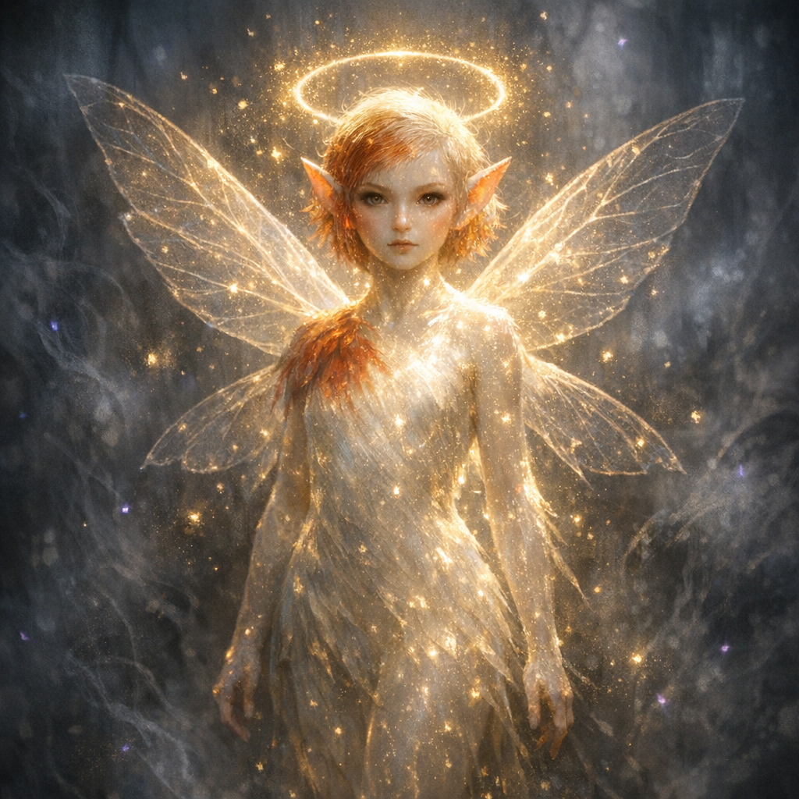

# Robin

#npc #companion

## Summary

Robin is Voltaire’s “Sun Card” turned disciple: a luminous, Tinkerbell-like companion created when Voltaire fed the Sun Card to a frog/toad and the two **merged** (Natural 20).

## Party Knowledge

- Robin exists and accompanies Voltaire.
- Robin is explicitly treated by Voltaire as a **follower/disciple**.

## Voltaire-Only Knowledge

- **Origin event**: A frog/toad had been following Voltaire. Voltaire flourished the [[Sun Card]] and stuffed it into the creature’s mouth; the amphibian shimmered with beautiful white light as it fused with the artifact and reformed into Robin.
- **Void realm test**: Robin followed Voltaire into a “void realm” where hordes of monsters were visible approaching; Robin retreated with Voltaire.
- Robin speaks quietly to Voltaire (e.g., commenting on the aspen tree’s “lovely noise” on the Shadowfell side of the gateway).
- Robin’s glow can change in response to the local “grace”/ambience (observed becoming more contained during Voltaire’s silent meditation under the Shadowfell aspen).

## Open Questions

- Is Robin an awakened manifestation of the Sun Card, a summoned entity, or a new being “born” from the card’s solar radiance?
- What can Robin do mechanically (actions, senses, limitations)?
